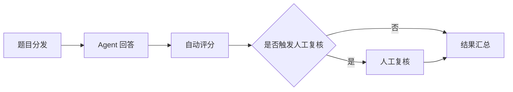

# 法律风控 DeepResearch Agent 测评题库

## 执行摘要

这份题库不是面向通用聊天机器人的问答集，而是面向**法律风控 DeepResearch Agent**的结构化测评集。它刻意把题目拆成“场景—用户原始提问—期望回答要点—证据链要求—自动评分—人工复核”六层，以便测试 agent 在**法域识别、检索规划、证据绑定、风险分级、结论边界、人工复核触发**上的完整能力，而不只是看能否“答得像律师”。这种设计与您当前项目的 DeepResearch V2 主链路高度一致：现有系统本身就是按 `planning → researching → analyzing → writing → reviewing` 的多阶段研究流水线运行，而法律化改造文档也明确建议新增 `legal_sources`、`risk_items`、`evidence_chain`、`disclaimers` 与 `human_review_required` 等字段。fileciteturn0file1L522-L538 fileciteturn0file0L414-L427 fileciteturn0file2L83-L88

题库以**中国大陆企业法务与合规**为主，覆盖合同、公司治理、劳动用工、商标/著作权、反不正当竞争、个人信息保护、行政处罚、并购尽调与诉讼研判等高频企业风险面，并在困难题中有选择地加入**香港 PDPO、EU GDPR 和 OFAC 制裁筛查**。香港个人资料私隐专员公署的官方说明指出，PDPO 适用于公私部门，并通过 DPPs 要求公平和最少必要收集、目的限制、保存期限控制以及数据主体访问更正；GDPR 官方文本仍是 EU 数据保护的核心法规，并在特定的大规模监控或特殊类别数据处理中要求指定 DPO 并承担持续合规监督义务；OFAC 官方页面则持续维护制裁项目、SDN/综合名单及搜索入口。与此同时，中国关于数据出境的配套规则在 2024 年出现放宽与细化，2025 年又有金融数据跨境细分指引，因此困难题被刻意设计为**动态规则 + 事实门槛 + 证据链 + 人工复核**联合考察，而不是死记静态法条。citeturn11view0turn10view4turn11view1turn6news0turn6news2

## 执行说明与评分模板

本题库采用统一的 `snake_case` 字段命名，布尔值使用 `true/false`，每题 `auto_scoring` 权重总和固定为 100，便于直接接入自动化测评系统或你现有的 agent 回归框架。评分逻辑建议按“**自动评分优先，人工复核兜底**”执行：自动评分用于判断法域、依据、证据链、风险分级和表述边界；人工评分用于识别检索质量、事实缺口敏感度、结论是否过界，以及是否在该触发复核时真正触发复核。这样的拆法正好与现有 DeepResearch/critic/checkpoint 机制匹配。fileciteturn0file1L593-L691 fileciteturn0file0L414-L427

自动评分模板建议统一采用以下三档。

- **困难题**：法域识别与冲突处理 20%、依据完整性 20%、证据引用准确性 25%、风险评分与优先级 15%、结论谨慎性 10%、格式与免责声明 10%  
- **中等题**：依据完整性 30%、法域识别 15%、证据引用准确性 25%、风险评分 15%、结论谨慎性 10%、格式与免责声明 5%  
- **简单题**：基础法规/条款识别 35%、事实核验与缺失提示 20%、法域识别 15%、结论谨慎性 15%、证据指向性 10%、格式与免责声明 5%

建议把以下情形设为**关键失败**：伪造法条/案例/处罚文书；主法域识别错误；在证据链缺失时给出确定性法律结论；把新闻或二手解读当成一级法律依据；遗漏重大事实缺口；应触发人工复核而未触发。建议把以下情形设为**强制人工复核**：跨境或多法域、制裁/出口管制、并购或上市、在审行政处罚或诉讼策略、重大数据泄露、刑事边界、敏感个人信息大规模处理、证据链明显不完整。评分参考的证据优先级应为：**现行法条/官方规则 > 裁判文书/处罚决定 > 合同原文/制度原文 > 企业工商与登记记录 > 第三方合规证明 > 新闻报道**。这一优先级与官方制度文本对目的限制、处理义务、名单筛查和持续合规职责的要求是相一致的。citeturn11view0turn10view4turn11view1

## 测评执行流程



上面的流程建议与现有项目的 DeepResearch V2 执行链路保持一致：先由 agent 完成规划、检索、分析、写作，再由 critic/评分器对“依据、证据链、结论边界、人审触发”做二次判定；如果你的实现后续要加 checkpoint 恢复或回归测试，这套结构也能直接落到自动化流水线上。fileciteturn0file1L522-L538 fileciteturn0file1L695-L712

## 可导入 JSON 题库

以下 JSON 数组共 30 个对象，字段已按自动化导入场景统一；其中 `expected_human_review_trigger`、`evidence_chain_requirements` 和 `auto_scoring` 是为你的法律风控 DeepResearch Agent 专门加出的评测结构。fileciteturn0file2L83-L88

```json
[
  {
    "id": "HARD_01",
    "difficulty": "困难",
    "task_type": "跨境数据合规与合同审查",
    "primary_jurisdiction": "中国大陆 / 香港 / EU",
    "scenario_summary": "一家在上海运营的人力资源 SaaS 公司为跨国客户处理中国大陆员工的考勤、薪酬和客服录音数据，计划把备份放在香港，并让位于德国的分包商做日志分析。合同已约定境外技术支持，但未单列数据出境机制。",
    "user_question": "我们是一家上海的人力资源 SaaS 供应商，客户要求把中国员工的考勤、薪酬和工单录音同步到香港灾备环境，并让德国分包商做日志分析。请你从中国大陆为主、兼顾香港和 EU 的角度，评估这套安排目前有哪些法律风控风险、需要走什么数据出境路径、合同里还缺哪些条款？",
    "expected_answer_points": [
      "先识别主法域为中国大陆，并提示香港和 EU 要作为并行影响法域处理；不能直接把 GDPR 结论替代中国大陆数据出境结论。",
      "应检索并引用个人信息保护法、网络安全法、数据安全法及现行数据出境配套规则，判断是否涉及个人信息、敏感个人信息、重要数据、关键信息基础设施或规模门槛。",
      "应区分三类流转：香港灾备、德国日志分析、客户远程访问；分别判断是否构成向境外提供个人信息或受托处理。",
      "应核对合同中是否已有数据处理协议、跨境传输条款、分包商管理、删除/返还、审计权、泄露通知、标准合同或认证协同条款；如缺失应明确指出。",
      "应提示关键事实缺口，例如数据量、数据字段、是否含敏感个人信息、客户身份、是否属于 CIIO、是否已有个人信息影响评估。",
      "结论应保持边界：可给出合规路径和风险分级，但不应在未知门槛和行业属性下给出“肯定可以出境”的确定性结论。",
      "应触发人工复核，原因是涉及跨境、多法域、敏感人力资源数据和合同重构。"
    ],
    "expected_human_review_trigger": {
      "required": true,
      "reason": "跨境、多法域、员工敏感数据、合同与数据出境路径耦合。"
    },
    "evidence_chain_requirements": [
      "中国大陆法规条文：个人信息保护法、数据安全法、网络安全法、数据出境配套规则",
      "香港个人资料私隐制度要点或官方指引",
      "GDPR 官方文本中与跨境处理、处理者、DPO/合规职责相关条款",
      "现有主服务合同、DPA/数据处理附件、分包商清单",
      "数据字段清单、数据流向图、系统架构说明、日志样本"
    ],
    "auto_scoring": [
      {
        "dimension": "法域识别与冲突处理",
        "weight": 20
      },
      {
        "dimension": "依据完整性",
        "weight": 20
      },
      {
        "dimension": "证据引用准确性",
        "weight": 25
      },
      {
        "dimension": "风险评分与优先级",
        "weight": 15
      },
      {
        "dimension": "结论谨慎性",
        "weight": 10
      },
      {
        "dimension": "格式与免责声明",
        "weight": 10
      }
    ],
    "human_scoring_notes": "重点看 agent 是否先做中国大陆主法域判断、再展开香港和 EU 辅助分析；是否明确事实缺口、合规路径及合同补强项，而不是泛泛罗列 GDPR 概念。"
  },
  {
    "id": "HARD_02",
    "difficulty": "困难",
    "task_type": "企业尽调与反商业贿赂",
    "primary_jurisdiction": "中国大陆 / 美国",
    "scenario_summary": "一家美国上市集团拟收购苏州一家医疗器械经销商 70% 股权。目标公司过去三年主要通过经销商顾问、学术会议和医院渠道拓客，账上存在大量咨询费、市场推广费和第三方返利。",
    "user_question": "我们准备收购一家苏州医疗器械经销商 70% 股权。请你帮我做一个反商业贿赂和合规尽调清单，重点分析顾问费、学术会议费、医院渠道返利、发票合规、第三方代理和历史行政处罚风险，并说明哪些问题如果没拿到原始凭证就不能下结论。",
    "expected_answer_points": [
      "应识别任务为并购尽调，不是单纯合同审查；主法域为中国大陆，因收购方为美国上市公司，应提示可能叠加海外反腐败合规要求，但不能直接代替中国法分析。",
      "应检索并引用反不正当竞争法下商业贿赂规则、医药/医疗器械行业监管规则、市场监管或卫健系统处罚口径，以及必要时提示刑事和证券合规外溢风险。",
      "应要求核验费用台账、合同、发票、付款流水、会议签到、服务成果、代理背景调查、医院招投标文件和回款路径，构建“费用—服务—对价—受益对象”证据链。",
      "应区分红旗事项：高额咨询费无成果、空壳代理、中介层级过多、与关键医院采购节点重合的市场推广费、同一供应商重复开票。",
      "应指出不能在缺少原始凭证、第三方尽调、处罚文书和财务流水时给出“未发现商业贿赂”的确定性结论。",
      "应给出风险分级和优先级，例如历史处罚、高风险代理、异常返点机制、发票不一致等。",
      "应触发人工复核，原因是并购交易、医疗行业、潜在海外反腐败与行政/刑事边界复杂。"
    ],
    "expected_human_review_trigger": {
      "required": true,
      "reason": "并购尽调、医疗行业、反商业贿赂与海外合规叠加。"
    },
    "evidence_chain_requirements": [
      "中国大陆法规条文和行业监管规则",
      "行政处罚决定、招投标公告/中标信息、市场监管公开记录",
      "顾问合同、服务报告、会议材料、发票、银行流水",
      "企业工商记录、关联方信息、受益所有人信息",
      "第三方合规证明、代理背景调查、内部审批制度"
    ],
    "auto_scoring": [
      {
        "dimension": "法域识别与冲突处理",
        "weight": 20
      },
      {
        "dimension": "依据完整性",
        "weight": 20
      },
      {
        "dimension": "证据引用准确性",
        "weight": 25
      },
      {
        "dimension": "风险评分与优先级",
        "weight": 15
      },
      {
        "dimension": "结论谨慎性",
        "weight": 10
      },
      {
        "dimension": "格式与免责声明",
        "weight": 10
      }
    ],
    "human_scoring_notes": "重点看 agent 能否把费用异常、交易结构和监管风险串成证据链，并明确哪些判断必须等待原始单据和访谈。"
  },
  {
    "id": "HARD_03",
    "difficulty": "困难",
    "task_type": "复杂合同审查与争议解决",
    "primary_jurisdiction": "中国大陆 / 香港",
    "scenario_summary": "一家深圳软件公司与香港客户签订双语主服务协议，约定香港仲裁、源代码托管、知识产权归属、责任上限和数据泄露通知，但中文与英文条款存在不一致，项目实际履行在深圳。",
    "user_question": "请帮我审查这份中英双语软件实施主服务协议。重点看知识产权归属、定制开发成果、源代码托管触发条件、数据泄露通知、责任限制、间接损失排除、验收标准，以及香港仲裁条款在内地申请财产保全和执行时会有什么风险。",
    "expected_answer_points": [
      "应先识别合同主法域、履行地、争议解决地和执行地四个层次，提示香港仲裁条款与内地履行/保全/执行之间的衔接问题。",
      "应审查双语不一致风险，明确应核对语言优先条款、定义条款、验收标准、里程碑和违约责任是否在中英文版本中对应一致。",
      "应引用合同法类规则、仲裁与执行相关规则，并提示香港仲裁在内地申请临时措施或保全时需要核实机构、席位和适用安排。",
      "应重点识别软件类合同常见高风险条款：IP 归属不清、开源组件责任缺失、托管触发门槛过高、验收默示通过、责任上限覆盖故意/重大过失或数据泄露。",
      "应要求补充项目说明书、SOW、交付清单、开源组件清单、数据处理附件和托管协议草案。",
      "结论应区分“可修改的商业条款风险”和“可能影响争议解决效果的法律风险”。",
      "应触发人工复核，原因是双语合同、跨境仲裁及执行保全问题需要律师逐条把关。"
    ],
    "expected_human_review_trigger": {
      "required": true,
      "reason": "中英双语、跨境仲裁、执行与保全衔接复杂。"
    },
    "evidence_chain_requirements": [
      "主服务协议正文及全部附件原文",
      "SOW/需求说明书、验收标准、交付清单",
      "源代码托管协议草案、开源组件清单",
      "仲裁条款文本、机构规则、保全/执行相关官方规则或司法安排",
      "过往同类争议案例或裁判文书"
    ],
    "auto_scoring": [
      {
        "dimension": "法域识别与冲突处理",
        "weight": 20
      },
      {
        "dimension": "依据完整性",
        "weight": 20
      },
      {
        "dimension": "证据引用准确性",
        "weight": 25
      },
      {
        "dimension": "风险评分与优先级",
        "weight": 15
      },
      {
        "dimension": "结论谨慎性",
        "weight": 10
      },
      {
        "dimension": "格式与免责声明",
        "weight": 10
      }
    ],
    "human_scoring_notes": "重点看是否真正做到逐条识别，而不是只列合同审查清单；尤其看双语优先、责任限制例外、保全与执行路径有没有说清。"
  },
  {
    "id": "HARD_04",
    "difficulty": "困难",
    "task_type": "数据事件响应与多法域通知义务",
    "primary_jurisdiction": "中国大陆 / 香港 / EU",
    "scenario_summary": "一家消费金融 App 在北京运营，用户覆盖中国大陆、香港和部分欧盟居民。公司发现第三方 SDK 导致身份证号、面部识别模板和联系人信息可能被异常传输至境外分析节点。",
    "user_question": "我们刚发现 App 的第三方 SDK 可能把用户身份证号、面部识别模板和联系人信息传到境外分析节点，受影响用户包含大陆、香港和少量 EU 居民。请你按事件响应的思路，帮我梳理先做什么、哪些法律通知义务需要判断、对外公告和对合同相对方通知要注意什么边界。",
    "expected_answer_points": [
      "应先把任务识别为数据事件响应，而非单纯合规解读；给出时间优先级，如封禁传输、证据保全、影响评估、内部升级和外部通知判断。",
      "应区分不同法域：大陆侧重个人信息保护和数据安全监管要求，香港侧重 PDPO 原则与执法风险，EU 侧重 GDPR 下 breach 评估和通知逻辑。",
      "应明确不能在未完成事件定级、影响范围核验和日志保全过程度前，直接写出绝对化对外口径。",
      "应要求调取 SDK 合同、DPA、日志、个人信息类型清单、用户地域识别、境外节点位置、加密/脱敏状态和历史版本记录。",
      "应识别高风险点：敏感个人信息、第三方共享链条不清、境外回传、是否已做单独同意、是否超出原始处理目的。",
      "应给出对内通知、对合作方通知、对监管通知、对用户通知的边界差异和最小必要披露原则。",
      "应触发人工复核，原因是数据泄露/疑似泄露、多法域通知与潜在执法风险并存。"
    ],
    "expected_human_review_trigger": {
      "required": true,
      "reason": "数据泄露、敏感个人信息、多法域通知义务。"
    },
    "evidence_chain_requirements": [
      "事件日志、接口调用记录、传输链路与 SDK 清单",
      "隐私政策、用户授权页面、SDK 合同/DPA",
      "中国大陆数据保护法规及配套规则",
      "香港 PDPO 官方规则或说明",
      "GDPR 官方文本中 breach、controller/processor、通知义务相关条款"
    ],
    "auto_scoring": [
      {
        "dimension": "法域识别与冲突处理",
        "weight": 20
      },
      {
        "dimension": "依据完整性",
        "weight": 20
      },
      {
        "dimension": "证据引用准确性",
        "weight": 25
      },
      {
        "dimension": "风险评分与优先级",
        "weight": 15
      },
      {
        "dimension": "结论谨慎性",
        "weight": 10
      },
      {
        "dimension": "格式与免责声明",
        "weight": 10
      }
    ],
    "human_scoring_notes": "重点看是否按照事件响应顺序组织回答，以及是否避免在事实尚未确认前做越界承诺。"
  },
  {
    "id": "HARD_05",
    "difficulty": "困难",
    "task_type": "制裁与出口管制合规",
    "primary_jurisdiction": "中国大陆 / 香港 / 美国",
    "scenario_summary": "一家无锡智能制造企业通过香港贸易公司向中东分销商销售含美国原产芯片的设备。业务团队发现分销商最终客户和付款路径不透明，且受益所有人可能与高风险名单重合。",
    "user_question": "我们准备通过香港贸易公司向中东分销商卖一批含美国原产芯片的设备，但对方不愿意完整披露最终客户和受益所有人。请你从中国大陆主体、香港贸易安排和美国制裁/名单筛查的角度，给我一份交易放行前的法律风控判断框架，说明哪些文件不到位就不应给出可放行结论。",
    "expected_answer_points": [
      "应识别这是交易前合规放行问题，主分析应覆盖中国大陆交易主体、香港贸易层和美国制裁/名单筛查影响，不应把一个法域结论简单外推到全部链条。",
      "应提示需要名单筛查、受益所有人核验、最终用途/最终用户声明、货物流/资金流一致性和美国原产技术成分判断。",
      "应引用或至少要求检索 OFAC 官方名单与制裁项目、美国出口管制相关官方资料，以及中国大陆进出口/对外贸易合规与内部审批制度。",
      "应把缺失事实列为阻断项：最终用户不明、受益所有人不明、付款经由高风险司法辖区、用途陈述与产品能力不匹配。",
      "应避免给出“只要不是美国公司就一定没问题”之类错误结论。",
      "应给出放行、补件、升级审查、终止交易四档建议，配套风险等级和责任人。",
      "应触发人工复核，原因是制裁、出口管制和多层贸易结构高度复杂。"
    ],
    "expected_human_review_trigger": {
      "required": true,
      "reason": "制裁/名单筛查、多层贸易结构、潜在出口管制。"
    },
    "evidence_chain_requirements": [
      "OFAC 官方制裁项目和名单筛查结果",
      "最终用途/最终用户声明、受益所有人文件、KYC 材料",
      "订单、运输路径、付款路径、信用证/收款账户信息",
      "产品 BOM、美国原产技术或芯片成分说明",
      "内部制裁筛查政策、审批记录"
    ],
    "auto_scoring": [
      {
        "dimension": "法域识别与冲突处理",
        "weight": 20
      },
      {
        "dimension": "依据完整性",
        "weight": 20
      },
      {
        "dimension": "证据引用准确性",
        "weight": 25
      },
      {
        "dimension": "风险评分与优先级",
        "weight": 15
      },
      {
        "dimension": "结论谨慎性",
        "weight": 10
      },
      {
        "dimension": "格式与免责声明",
        "weight": 10
      }
    ],
    "human_scoring_notes": "重点看 agent 是否知道“名单筛查+受益所有人+用途+产品成分+资金路径”是联动判断，而不是只做名单搜索。"
  },
  {
    "id": "HARD_06",
    "difficulty": "困难",
    "task_type": "劳动争议与商业秘密保护",
    "primary_jurisdiction": "中国大陆 / 香港",
    "scenario_summary": "一家在深圳设研发中心、香港设区域销售团队的科技公司，发现核心算法工程师离职前将代码片段和客户报价单上传到个人网盘，并入职同城竞争对手。劳动合同、保密协议和竞业限制协议签署版本不一致。",
    "user_question": "请以企业法务视角，分析这名工程师离职后的商业秘密和劳动争议风险。我要知道先固定哪些证据、能不能主张竞业限制、哪些行为可能构成保密义务违约，深圳和香港两边签的文件冲突时应怎么处理。",
    "expected_answer_points": [
      "应先梳理文件层级：劳动合同、保密协议、竞业限制协议、员工手册、代码仓访问日志、离职交接清单；并识别不同地点签署文件的适用范围。",
      "应区分商业秘密侵害、合同违约、竞业限制、数据/个人信息、证据保全这几条路径，而非混为一谈。",
      "应要求固定电子取证：仓库日志、下载记录、邮件、网盘访问、设备审计、客户报价单版本留痕、HR 流程记录。",
      "应提示竞业限制是否有效要看岗位、期限、地域、补偿支付和竞业范围；不能仅凭签过协议就断定一定有效。",
      "应说明香港与深圳签署文件不一致时，需要先判断劳动关系主体、履行地、约定法和争议解决条款。",
      "应给出应急动作优先级：账户冻结、证据保全、停止侵权函、客户沟通、是否申请行为保全/禁令的路径判断。",
      "应触发人工复核，原因是劳动、商业秘密、跨境证据和紧急措施交叉。"
    ],
    "expected_human_review_trigger": {
      "required": true,
      "reason": "劳动与商业秘密交叉，且涉及跨境文件冲突和紧急措施。"
    },
    "evidence_chain_requirements": [
      "劳动合同、保密协议、竞业限制协议、员工手册原文",
      "代码仓库日志、邮件/IM 记录、网盘/终端审计记录",
      "离职交接清单、补偿支付记录、岗位说明书",
      "客户报价单、商业秘密分级制度、访问权限记录",
      "相关裁判文书或典型案例"
    ],
    "auto_scoring": [
      {
        "dimension": "法域识别与冲突处理",
        "weight": 20
      },
      {
        "dimension": "依据完整性",
        "weight": 20
      },
      {
        "dimension": "证据引用准确性",
        "weight": 25
      },
      {
        "dimension": "风险评分与优先级",
        "weight": 15
      },
      {
        "dimension": "结论谨慎性",
        "weight": 10
      },
      {
        "dimension": "格式与免责声明",
        "weight": 10
      }
    ],
    "human_scoring_notes": "重点看 agent 是否真正把证据固定放在第一优先级，以及是否正确提示竞业限制有效性的前提条件。"
  },
  {
    "id": "HARD_07",
    "difficulty": "困难",
    "task_type": "公司治理与融资尽调",
    "primary_jurisdiction": "中国大陆 / 香港 / 开曼",
    "scenario_summary": "一家拟赴港上市的科技企业采用开曼控股 + 香港中间层 + 境内经营实体结构，历史上有多轮股东代持、员工期权口头承诺、关联交易和数据合规整改记录。",
    "user_question": "请你站在 Pre-IPO 法务尽调视角，给我梳理这家公司最需要优先核查的公司治理和法律风控问题。重点看股权代持、历史增资、员工期权口头承诺、关联交易、董事会程序、数据合规整改、重大诉讼和行政处罚披露边界。",
    "expected_answer_points": [
      "应识别任务为上市前法律尽调，区分股权清晰度、公司治理、信息披露、监管合规和重大争议五大模块。",
      "应要求核查境内外主体的公司文件、章程、股东协议、历次增资文件、董事会/股东会决议、期权计划、员工函件和代持解除文件。",
      "应指出代持、未规范审批的关联交易、口头承诺的股权激励、历史行政处罚和正在整改的数据问题都可能影响披露和交易交割条件。",
      "应说明不能在没有核到境内外公司登记、穿透股权和处罚文书前，对“股权清晰、无重大合规障碍”下结论。",
      "应给出重大性判断维度：金额、持续性、是否影响控制权、是否影响上市披露、是否已整改闭环。",
      "应提示需要跨法域人工复核，尤其是开曼/香港控股文件与内地经营合规之间的穿透核验。",
      "应触发人工复核。"
    ],
    "expected_human_review_trigger": {
      "required": true,
      "reason": "Pre-IPO 穿透尽调、多法域主体、重大披露判断。"
    },
    "evidence_chain_requirements": [
      "境内外公司注册与章程文件、股东名册、董事会/股东会决议",
      "历次增资、股权转让、代持协议及解除文件",
      "期权计划、员工承诺函、关联交易合同与审批材料",
      "重大诉讼/仲裁、行政处罚、整改报告、监管问询",
      "数据合规制度、审计报告、尽调底稿"
    ],
    "auto_scoring": [
      {
        "dimension": "法域识别与冲突处理",
        "weight": 20
      },
      {
        "dimension": "依据完整性",
        "weight": 20
      },
      {
        "dimension": "证据引用准确性",
        "weight": 25
      },
      {
        "dimension": "风险评分与优先级",
        "weight": 15
      },
      {
        "dimension": "结论谨慎性",
        "weight": 10
      },
      {
        "dimension": "格式与免责声明",
        "weight": 10
      }
    ],
    "human_scoring_notes": "重点看 agent 是否能把‘控制权清晰—程序完备—披露边界—整改闭环’串成上市尽调逻辑。"
  },
  {
    "id": "HARD_08",
    "difficulty": "困难",
    "task_type": "行政处罚分析与整改闭环",
    "primary_jurisdiction": "中国大陆",
    "scenario_summary": "一家连锁零售企业因门店人脸识别会员系统、过度收集手机号和长期保留消费轨迹，被地方网信和市场监管部门分别立案并已收到处罚告知书。",
    "user_question": "我们收到了两份处罚告知：一份说会员系统人脸识别超范围，一份说把手机号和消费轨迹保存过久。请你把这两起处罚并案分析，判断我们最需要立即整改的事项、复议/申辩空间大不大、以及后续制度和合同要补哪些东西。",
    "expected_answer_points": [
      "应先区分两份告知书的执法机关、法律依据、违法行为类型和程序阶段，不能笼统并论。",
      "应要求核对处罚告知书原文、取证笔录、隐私政策、会员页面、门店告知物料、供应商合同、保留期限策略和历史整改记录。",
      "应识别人脸识别、超范围收集、保存期限过长、第三方服务商责任分配、用户授权文案问题等核心风险点。",
      "应给出整改优先级：先停用高风险处理场景，再修订弹窗/告知/同意机制，再清理历史数据，再补 DPA 和安全措施。",
      "应对申辩/复议边界保持谨慎，只能提示可能的程序或事实争点，不能在未阅卷时保证成功。",
      "应输出处罚后闭环清单，包括制度、培训、供应商管理、留存期限、影响评估和再次上线条件。",
      "应触发人工复核，原因是已进入执法程序并涉及申辩策略。"
    ],
    "expected_human_review_trigger": {
      "required": true,
      "reason": "已进入行政处罚程序，涉及申辩/复议和整改闭环。"
    },
    "evidence_chain_requirements": [
      "行政处罚告知书、询问笔录、检查记录",
      "隐私政策、同意弹窗、门店告知物料、会员流程截图",
      "供应商合同、SDK/设备清单、DPA",
      "数据保留策略、删除日志、培训制度、整改记录",
      "相关法规条文和官方指引"
    ],
    "auto_scoring": [
      {
        "dimension": "法域识别与冲突处理",
        "weight": 20
      },
      {
        "dimension": "依据完整性",
        "weight": 20
      },
      {
        "dimension": "证据引用准确性",
        "weight": 25
      },
      {
        "dimension": "风险评分与优先级",
        "weight": 15
      },
      {
        "dimension": "结论谨慎性",
        "weight": 10
      },
      {
        "dimension": "格式与免责声明",
        "weight": 10
      }
    ],
    "human_scoring_notes": "重点看 agent 是否能把程序阶段、事实争点和整改优先级分开说清。"
  },
  {
    "id": "HARD_09",
    "difficulty": "困难",
    "task_type": "AI 知识产权与数据合规",
    "primary_jurisdiction": "中国大陆 / EU / 美国",
    "scenario_summary": "一家北京 AI 公司准备用公开网页文章、设计图片、GitHub 代码和客户客服记录训练多模态模型，计划在中国大陆先商用，后向欧洲客户提供 API。",
    "user_question": "请你帮我评估这个模型训练方案的法律风控：训练语料里有公开文章、设计图片、GitHub 代码和客户客服记录，后续还想向欧洲客户提供 API。我要知道哪些素材最危险、哪些证据要先补、合同和产品侧要加哪些限制，哪些结论必须留给人工律师判断。",
    "expected_answer_points": [
      "应区分四类语料风险：版权作品、商标/品牌元素、开源软件许可、含个人信息或商业秘密的客服记录。",
      "应明确中国大陆主法域分析，同时提示面向 EU 客户商业化可能叠加 GDPR、版权许可和 ToS/爬取限制等问题。",
      "应要求核验数据来源合法性、许可链、抓取规则、开源许可证兼容性、去标识化处理、客户授权和数据集留痕。",
      "应指出仅因素材“公开可访问”并不当然意味着可无条件训练或商业化使用。",
      "应给出产品与合同侧控制点：训练数据治理台账、黑名单来源、客户数据开关、输出过滤、第三方侵权投诉机制、服务条款限制。",
      "应提示模型训练的著作权合理使用、开源传染性条款、个人信息匿名化充分性等问题存在较强争议，不能给绝对安全结论。",
      "应触发人工复核，原因是 AI、版权、开源许可、个人信息和跨境商用叠加。"
    ],
    "expected_human_review_trigger": {
      "required": true,
      "reason": "AI 训练语料涉及版权、开源、个人信息和跨境商用。"
    },
    "evidence_chain_requirements": [
      "数据来源清单、抓取规则、授权/许可证明、网站 ToS",
      "GitHub 仓库许可证文本、依赖清单、模型数据治理台账",
      "客服记录样本、脱敏/匿名化说明、客户合同及授权条款",
      "中国大陆知识产权与个人信息法规条文",
      "EU GDPR 官方文本及必要的版权/平台规则说明"
    ],
    "auto_scoring": [
      {
        "dimension": "法域识别与冲突处理",
        "weight": 20
      },
      {
        "dimension": "依据完整性",
        "weight": 20
      },
      {
        "dimension": "证据引用准确性",
        "weight": 25
      },
      {
        "dimension": "风险评分与优先级",
        "weight": 15
      },
      {
        "dimension": "结论谨慎性",
        "weight": 10
      },
      {
        "dimension": "格式与免责声明",
        "weight": 10
      }
    ],
    "human_scoring_notes": "重点看 agent 是否把‘公开可访问 != 可自由训练/商用’说清，并给出可执行的数据治理控制点。"
  },
  {
    "id": "HARD_10",
    "difficulty": "困难",
    "task_type": "案件研判与公司法争议",
    "primary_jurisdiction": "中国大陆",
    "scenario_summary": "一家有限责任公司两名 50% 股东长期僵持，少数股东主张对方抽逃出资、侵占公司机会并拒绝分红，同时公司存在对外担保和逾期应收账款。公司准备提起诉讼并申请财产保全。",
    "user_question": "请你按案件研判的方式分析这起股东僵局纠纷：我想知道抽逃出资、董事忠实义务、公司机会侵占、利润分配争议和对外担保决议瑕疵分别怎么取证，适合先起什么诉、保全申请该准备什么、哪些争点如果证据不够就只能做概率判断。",
    "expected_answer_points": [
      "应将争点拆分为出资瑕疵、董事/实际控制人义务、利润分配、担保决议效力、保全条件五部分，而不是合并成泛泛公司纠纷。",
      "应要求核验章程、出资凭证、银行流水、会计账、股东会/董事会决议、印章使用记录、关联交易文件和项目机会流向。",
      "应结合现行公司法框架提示举证责任、公司治理文件的重要性以及保全前对债权基础和损害紧迫性的证明需求。",
      "应给出诉讼路径选择思路，如公司诉、股东代表诉、决议效力之诉、损害赔偿或行为保全，并说明各自前提。",
      "应明确哪些结论只能做概率判断：例如是否构成公司机会侵占、担保相对人善意与否、利润分配条件是否成熟。",
      "应给出风险分级和证据缺口清单，不应许诺胜诉或保全必然获准。",
      "应触发人工复核，原因是诉讼策略和保全方案高度依赖证据细节。"
    ],
    "expected_human_review_trigger": {
      "required": true,
      "reason": "诉讼策略、保全申请和公司法争点复杂。"
    },
    "evidence_chain_requirements": [
      "公司章程、股东名册、出资证明、银行流水、审计材料",
      "股东会/董事会决议、印章和授权文件",
      "对外担保合同、关联交易文件、项目机会流向证据",
      "法院裁判文书、公司法条文、保全规则",
      "往来邮件、聊天记录、催收材料"
    ],
    "auto_scoring": [
      {
        "dimension": "法域识别与冲突处理",
        "weight": 20
      },
      {
        "dimension": "依据完整性",
        "weight": 20
      },
      {
        "dimension": "证据引用准确性",
        "weight": 25
      },
      {
        "dimension": "风险评分与优先级",
        "weight": 15
      },
      {
        "dimension": "结论谨慎性",
        "weight": 10
      },
      {
        "dimension": "格式与免责声明",
        "weight": 10
      }
    ],
    "human_scoring_notes": "重点看 agent 是否真正按诉讼争点拆题，并对保全与主张路径作证据导向分析。"
  },
  {
    "id": "MED_01",
    "difficulty": "中等",
    "task_type": "合同审查",
    "primary_jurisdiction": "中国大陆",
    "scenario_summary": "一家杭州制造企业拟与核心零部件供应商签订年度采购协议，合同约定了月度交付、验收和价格调整，但违约责任和质量保证偏弱。",
    "user_question": "请帮我审查这份年度采购协议，重点看质量保证、验收标准、逾期交付、价格调整、责任上限和解除权。请直接告诉我哪些条款最容易在履约时出问题，以及应该要求供应商怎么改。",
    "expected_answer_points": [
      "应识别为中国大陆货物采购合同审查，并引用民法典合同编中的典型风险框架。",
      "应逐项检查验收标准是否客观、期限是否明确、逾期交付与不合格品处理是否可执行。",
      "应指出价格调整机制、责任上限、违约金/损失赔偿和单方解除权是否失衡。",
      "应要求补充技术规格、质保期限、替换/返修时限、索赔程序和留样规则。",
      "若合同未附技术附件或验收标准，应明确提示这是关键事实缺口。",
      "一般不必触发人工复核，除非合同金额重大或涉及召回/出口。"
    ],
    "expected_human_review_trigger": {
      "required": false,
      "reason": "普通采购协议，除非金额重大或行业监管特殊。"
    },
    "evidence_chain_requirements": [
      "采购协议正文和技术附件",
      "验收标准、样品确认记录、质保条款原文",
      "民法典合同编相关条文",
      "过往履约争议或质量投诉记录（如有）"
    ],
    "auto_scoring": [
      {
        "dimension": "依据完整性",
        "weight": 30
      },
      {
        "dimension": "法域识别",
        "weight": 15
      },
      {
        "dimension": "证据引用准确性",
        "weight": 25
      },
      {
        "dimension": "风险评分",
        "weight": 15
      },
      {
        "dimension": "结论谨慎性",
        "weight": 10
      },
      {
        "dimension": "格式与免责声明",
        "weight": 5
      }
    ],
    "human_scoring_notes": "重点看是否指出可执行性问题，而不是只列模板条款。"
  },
  {
    "id": "MED_02",
    "difficulty": "中等",
    "task_type": "劳动用工",
    "primary_jurisdiction": "中国大陆",
    "scenario_summary": "一家上海互联网公司拟解除一名产品经理劳动合同，员工主张长期加班、年终奖承诺和竞业限制补偿均存在争议。",
    "user_question": "请分析这名产品经理离职时最大的劳动争议风险。重点看解除理由、加班费、年终奖、未休年假和竞业限制补偿，告诉我公司现在最该补什么证据。",
    "expected_answer_points": [
      "应识别为劳动争议风险分析，主法域为中国大陆。",
      "应要求核验劳动合同、考勤记录、绩效文件、年终奖制度、审批流、竞业协议和补偿支付记录。",
      "应区分解除合法性、工资报酬、休假补偿和竞业限制有效性四类问题。",
      "应指出没有制度公示、无考勤留痕、年终奖承诺口径不一致时，结论应保守。",
      "应给出证据优先级和风险评分，而不是直接判断公司一定胜诉或败诉。",
      "如涉及高管、大额补偿或群体性影响，可提示人工复核。"
    ],
    "expected_human_review_trigger": {
      "required": false,
      "reason": "通常可自动分析；涉及高管、大额补偿或舆情时建议复核。"
    },
    "evidence_chain_requirements": [
      "劳动合同、解除通知、考勤记录、工资单",
      "年终奖制度、绩效考核和邮件/IM 承诺",
      "竞业限制协议、补偿支付记录、员工手册",
      "劳动合同法及劳动争议规则"
    ],
    "auto_scoring": [
      {
        "dimension": "依据完整性",
        "weight": 30
      },
      {
        "dimension": "法域识别",
        "weight": 15
      },
      {
        "dimension": "证据引用准确性",
        "weight": 25
      },
      {
        "dimension": "风险评分",
        "weight": 15
      },
      {
        "dimension": "结论谨慎性",
        "weight": 10
      },
      {
        "dimension": "格式与免责声明",
        "weight": 5
      }
    ],
    "human_scoring_notes": "重点看 agent 是否把‘先补证据再下结论’讲清楚。"
  },
  {
    "id": "MED_03",
    "difficulty": "中等",
    "task_type": "知识产权",
    "primary_jurisdiction": "中国大陆",
    "scenario_summary": "一家消费电子品牌准备推出新商标，但法务检索发现存在近似在先注册和一件正在异议中的同类商标。",
    "user_question": "我们要上线一个新品牌名，请你判断商标注册和使用风险。请告诉我需要查哪些在先权利、近似风险怎么分级、如果已经做了包装和投放素材，还有哪些补救动作。",
    "expected_answer_points": [
      "应识别为商标清除检索与使用风险评估，而不是一般品牌建议。",
      "应要求核验分类、商品/服务项目、在先注册、异议/无效状态和近似标识使用场景。",
      "应提示除商标注册外，还要核查字号、域名、著作权元素和包装装潢的冲突。",
      "应区分“可注册性风险”和“先使用即侵权/不正当竞争风险”。",
      "已有包装和投放素材时，应给出停用、替换、过渡使用和保全证据建议。",
      "一般不必触发人工复核，但若品牌已大规模投放或涉跨境，应升级。"
    ],
    "expected_human_review_trigger": {
      "required": false,
      "reason": "常规商标清查；大规模投放或跨境品牌战略时建议复核。"
    },
    "evidence_chain_requirements": [
      "商标检索结果、类别和商品/服务清单",
      "包装、Logo、宣传素材样稿",
      "商标法、反不正当竞争法相关规则",
      "异议/无效或近似案例资料"
    ],
    "auto_scoring": [
      {
        "dimension": "依据完整性",
        "weight": 30
      },
      {
        "dimension": "法域识别",
        "weight": 15
      },
      {
        "dimension": "证据引用准确性",
        "weight": 25
      },
      {
        "dimension": "风险评分",
        "weight": 15
      },
      {
        "dimension": "结论谨慎性",
        "weight": 10
      },
      {
        "dimension": "格式与免责声明",
        "weight": 5
      }
    ],
    "human_scoring_notes": "重点看是否区分注册风险与使用风险。"
  },
  {
    "id": "MED_04",
    "difficulty": "中等",
    "task_type": "合规差距分析",
    "primary_jurisdiction": "中国大陆",
    "scenario_summary": "一家生活服务 App 更新了隐私政策，但仍默认勾选通讯录、定位和设备标识采集，且 SDK 列表未对外披露完整。",
    "user_question": "请你按合规差距分析的方式检查我们 App 的隐私政策和授权流程，重点看默认勾选、通讯录、定位、设备标识、第三方 SDK 披露和用户删除路径。我要一个按优先级排序的整改清单。",
    "expected_answer_points": [
      "应识别主法域为中国大陆的数据合规差距分析。",
      "应分别审查隐私政策文本、授权弹窗、功能必要性、SDK 披露和用户权利实现路径。",
      "应指出默认勾选、非必要权限捆绑、删除/撤回同意路径不清、SDK 披露不完整等高频风险。",
      "应要求补充应用页面截图、SDK 清单、数据字段清单、是否区分必要/可选权限等事实。",
      "应给出 P1/P2/P3 整改优先级，而不是只罗列法律原则。",
      "如涉及敏感个人信息或大规模用户数据，可提示人工复核。"
    ],
    "expected_human_review_trigger": {
      "required": false,
      "reason": "标准化差距分析可自动完成；敏感信息规模大时建议复核。"
    },
    "evidence_chain_requirements": [
      "隐私政策全文、授权弹窗截图、用户删除流程截图",
      "SDK 清单、权限用途说明、数据字段清单",
      "个人信息保护法及 App 合规相关官方规则/指引",
      "版本更新记录"
    ],
    "auto_scoring": [
      {
        "dimension": "依据完整性",
        "weight": 30
      },
      {
        "dimension": "法域识别",
        "weight": 15
      },
      {
        "dimension": "证据引用准确性",
        "weight": 25
      },
      {
        "dimension": "风险评分",
        "weight": 15
      },
      {
        "dimension": "结论谨慎性",
        "weight": 10
      },
      {
        "dimension": "格式与免责声明",
        "weight": 5
      }
    ],
    "human_scoring_notes": "重点看是否能输出优先级明确、可落地的整改清单。"
  },
  {
    "id": "MED_05",
    "difficulty": "中等",
    "task_type": "行政处罚分析",
    "primary_jurisdiction": "中国大陆",
    "scenario_summary": "一家美妆品牌因直播间宣称“医学级修复”“零刺激永久美白”被市场监管部门处罚，法务需要评估处罚依据和后续整改。",
    "user_question": "请你分析这份广告处罚决定书。我要知道处罚依据是否站得住、我们是内容风险还是证据风险、后续直播和投放素材要怎么改，类似表述还能不能继续用。",
    "expected_answer_points": [
      "应识别为广告/宣传行政处罚分析，主法域为中国大陆。",
      "应核对处罚决定书、直播脚本、商品备案/功效证明、KOL 话术和审批记录。",
      "应区分绝对化用语、功效宣称证据不足、医疗暗示和虚假/引人误解宣传几类风险。",
      "应给出整改动作：停用表述、补证、重建审稿流程、对主播与代理商统一口径。",
      "应提醒不能在未核到全部证据和决定书全文前下“处罚违法/必然可撤销”结论。",
      "一般不必触发人工复核；若准备复议或诉讼则应升级。"
    ],
    "expected_human_review_trigger": {
      "required": false,
      "reason": "普通处罚分析可自动完成；涉及复议/诉讼策略时建议复核。"
    },
    "evidence_chain_requirements": [
      "处罚决定书、直播脚本、商品备案/检测报告",
      "广告素材、投放记录、审批流程文件",
      "广告法、市场监管处罚口径、相关案例"
    ],
    "auto_scoring": [
      {
        "dimension": "依据完整性",
        "weight": 30
      },
      {
        "dimension": "法域识别",
        "weight": 15
      },
      {
        "dimension": "证据引用准确性",
        "weight": 25
      },
      {
        "dimension": "风险评分",
        "weight": 15
      },
      {
        "dimension": "结论谨慎性",
        "weight": 10
      },
      {
        "dimension": "格式与免责声明",
        "weight": 5
      }
    ],
    "human_scoring_notes": "重点看是否区分‘没有证据支撑’和‘表述本身高风险’。"
  },
  {
    "id": "MED_06",
    "difficulty": "中等",
    "task_type": "企业尽调",
    "primary_jurisdiction": "中国大陆",
    "scenario_summary": "一家拟合作的物流服务商在工商系统显示存在经营异常移出记录、数起劳动争议和一件未结案交通事故赔偿诉讼。",
    "user_question": "请帮我做合作前法律尽调，重点看这家物流服务商的工商、经营异常、诉讼、行政处罚和履约能力风险。我要知道哪些属于可接受风险，哪些应该作为签约前置条件。",
    "expected_answer_points": [
      "应识别为交易前对手方尽调，不是诉讼代理。",
      "应要求核验工商登记、行政处罚、异常经营记录、裁判文书、被执行/失信、资质许可和保险情况。",
      "应区分主体资格风险、合规风险、履约能力风险和声誉风险。",
      "应给出签约前置条件建议，如补充资质、保证金、保险、母公司担保、陈述保证和解约条款。",
      "应说明仅凭公开记录无法完全判断履约能力，需要结合财务、车辆/人员、客户投诉等补充材料。",
      "一般不必触发人工复核。"
    ],
    "expected_human_review_trigger": {
      "required": false,
      "reason": "标准尽调场景，一般可自动分析。"
    },
    "evidence_chain_requirements": [
      "企业工商记录、资质许可、异常经营信息",
      "裁判文书、被执行/失信、行政处罚记录",
      "保险证明、车辆/人员资质、客户投诉或事故记录",
      "拟签合同中的陈述保证和担保条款"
    ],
    "auto_scoring": [
      {
        "dimension": "依据完整性",
        "weight": 30
      },
      {
        "dimension": "法域识别",
        "weight": 15
      },
      {
        "dimension": "证据引用准确性",
        "weight": 25
      },
      {
        "dimension": "风险评分",
        "weight": 15
      },
      {
        "dimension": "结论谨慎性",
        "weight": 10
      },
      {
        "dimension": "格式与免责声明",
        "weight": 5
      }
    ],
    "human_scoring_notes": "重点看是否能把公开记录转化为具体交易保护条款建议。"
  },
  {
    "id": "MED_07",
    "difficulty": "中等",
    "task_type": "软件外包合同审查",
    "primary_jurisdiction": "中国大陆",
    "scenario_summary": "一家南京制造企业将 MES 系统二次开发外包给本地软件公司，项目采用里程碑交付，但未明确底层平台授权、源代码交付和开源合规。",
    "user_question": "请审查这份软件外包合同，重点看源代码交付、知识产权归属、第三方组件、开源合规、验收和运维支持。我要一个按风险等级排序的审查意见。",
    "expected_answer_points": [
      "应识别这是软件开发外包合同，不应套用一般采购合同模板。",
      "应检查开发成果归属、第三方组件许可、源代码交付范围、交付物清单、运维期限和验收标准。",
      "应指出开源组件合规、底层平台授权、二次授权风险和知识产权侵权赔偿条款的重要性。",
      "应要求补充需求说明书、架构图、第三方组件清单和部署边界。",
      "应按高/中/低风险输出审查意见，而不是只给笼统建议。",
      "通常不必触发人工复核；涉核心生产系统或涉外许可时可升级。"
    ],
    "expected_human_review_trigger": {
      "required": false,
      "reason": "标准软件外包审查；核心系统或涉外许可时建议复核。"
    },
    "evidence_chain_requirements": [
      "外包合同正文、需求说明书、交付清单",
      "第三方组件清单、开源许可证文本、平台授权",
      "验收标准、运维 SLA、知识产权条款",
      "相关合同法和知识产权规则"
    ],
    "auto_scoring": [
      {
        "dimension": "依据完整性",
        "weight": 30
      },
      {
        "dimension": "法域识别",
        "weight": 15
      },
      {
        "dimension": "证据引用准确性",
        "weight": 25
      },
      {
        "dimension": "风险评分",
        "weight": 15
      },
      {
        "dimension": "结论谨慎性",
        "weight": 10
      },
      {
        "dimension": "格式与免责声明",
        "weight": 5
      }
    ],
    "human_scoring_notes": "重点看是否真正识别软件外包特有条款。"
  },
  {
    "id": "MED_08",
    "difficulty": "中等",
    "task_type": "劳动用工合规差距分析",
    "primary_jurisdiction": "中国大陆",
    "scenario_summary": "一家全国连锁零售企业大量使用劳务派遣和外包岗位，一线岗位与正式员工长期混岗，同岗不同薪情况明显。",
    "user_question": "请做一个劳务派遣和外包用工合规差距分析，重点看岗位性质、同岗同酬、派遣比例、外包实质管理和被认定为事实劳动关系的风险。",
    "expected_answer_points": [
      "应区分劳务派遣与业务外包的法律边界，不应混用概念。",
      "应要求核验岗位说明、组织架构、考勤管理、薪酬结构、派遣人数占比和外包服务合同。",
      "应重点识别临时性/辅助性/替代性岗位要求、同岗同酬、实质管理和事实劳动关系风险。",
      "应输出制度整改和合同整改两类建议。",
      "在人数规模、岗位分布未知时，应提示事实缺口并保持结论谨慎。",
      "如规模大且可能引发集体争议，建议人工复核。"
    ],
    "expected_human_review_trigger": {
      "required": false,
      "reason": "常规差距分析可自动做；大规模用工调整时建议复核。"
    },
    "evidence_chain_requirements": [
      "派遣协议、外包合同、岗位说明、组织架构",
      "考勤与排班记录、薪酬表、人数占比统计",
      "员工手册、用工制度、劳动合同法及相关规则"
    ],
    "auto_scoring": [
      {
        "dimension": "依据完整性",
        "weight": 30
      },
      {
        "dimension": "法域识别",
        "weight": 15
      },
      {
        "dimension": "证据引用准确性",
        "weight": 25
      },
      {
        "dimension": "风险评分",
        "weight": 15
      },
      {
        "dimension": "结论谨慎性",
        "weight": 10
      },
      {
        "dimension": "格式与免责声明",
        "weight": 5
      }
    ],
    "human_scoring_notes": "重点看是否能抓住‘实质管理’这一核心判断点。"
  },
  {
    "id": "MED_09",
    "difficulty": "中等",
    "task_type": "反商业贿赂合规",
    "primary_jurisdiction": "中国大陆",
    "scenario_summary": "一家消费品公司为经销商大会和渠道促销设置了返利、旅游、礼品和培训补贴方案，法务需判断是否触碰商业贿赂和账务合规红线。",
    "user_question": "请你审查这套经销商激励方案：返利、旅游、礼品、培训补贴和陈列费都在里面。我要知道哪些设计最容易被认定为商业贿赂或账外利益，审批和留痕应该怎么补。",
    "expected_answer_points": [
      "应识别为渠道激励合规审查，而非单纯商业政策意见。",
      "应区分正常折扣/返利、市场推广支持与向交易相对方或其工作人员输送不当利益的情形。",
      "应要求核验激励规则、公开透明度、合同约定、发票与报销、受益对象、审批流程和服务成果留痕。",
      "应指出旅游、礼品、个人报销、异常陈列费、无成果培训补贴等高风险点。",
      "应给出制度控制建议：金额阈值、审批人、禁止事项、证据留存和抽查机制。",
      "一般不必触发人工复核；涉政府/国企客户时应升级。"
    ],
    "expected_human_review_trigger": {
      "required": false,
      "reason": "一般商业渠道场景可自动分析；涉公立机构或国企时建议复核。"
    },
    "evidence_chain_requirements": [
      "激励方案文本、经销商合同、审批制度、报销/发票样本",
      "受益对象清单、培训/陈列成果照片或记录",
      "反不正当竞争法及相关处罚案例/指引"
    ],
    "auto_scoring": [
      {
        "dimension": "依据完整性",
        "weight": 30
      },
      {
        "dimension": "法域识别",
        "weight": 15
      },
      {
        "dimension": "证据引用准确性",
        "weight": 25
      },
      {
        "dimension": "风险评分",
        "weight": 15
      },
      {
        "dimension": "结论谨慎性",
        "weight": 10
      },
      {
        "dimension": "格式与免责声明",
        "weight": 5
      }
    ],
    "human_scoring_notes": "重点看 agent 是否能把激励政策转化为受益对象、透明度和留痕控制的审查框架。"
  },
  {
    "id": "MED_10",
    "difficulty": "中等",
    "task_type": "跨境 HR 数据合规",
    "primary_jurisdiction": "中国大陆 / 新加坡",
    "scenario_summary": "一家上海外资制造企业计划把中国员工的绩效、薪酬和调查问卷同步到新加坡区域总部做人力分析，现有员工手册仅泛泛提到“集团内部共享”。",
    "user_question": "请判断把中国员工的绩效、薪酬和问卷数据同步到新加坡总部做 HR 分析，有哪些核心合规风险？我需要知道是先改告知同意、先补合同，还是先做评估；如果员工手册只写了集团内部共享够不够。",
    "expected_answer_points": [
      "应识别为中国大陆出境的人力资源数据合规问题，并提示新加坡接收方管理要求。",
      "应区分告知/同意、必要性、最小化、受托处理或共同处理、跨境评估文件这几类问题。",
      "应指出员工手册中的笼统“集团内部共享”通常不足以替代具体透明告知和跨境安排判断。",
      "应要求补充数据字段、数量、敏感信息情况、接收方角色、用途、保留期限和安全措施。",
      "应给出执行顺序建议：先盘点数据和场景，再评估路径，再补制度和合同文本。",
      "通常建议人工复核，但在中等难度下可将其设为“视数据规模和敏感程度而定”。"
    ],
    "expected_human_review_trigger": {
      "required": false,
      "reason": "基础框架可自动完成；若涉及大量敏感 HR 数据则建议复核。"
    },
    "evidence_chain_requirements": [
      "员工手册、隐私告知、同意文本、集团数据共享政策",
      "数据字段清单、接收方角色说明、跨境传输链路",
      "个人信息保护法及数据出境配套规则",
      "总部 DPA、保留期限和安全措施说明"
    ],
    "auto_scoring": [
      {
        "dimension": "依据完整性",
        "weight": 30
      },
      {
        "dimension": "法域识别",
        "weight": 15
      },
      {
        "dimension": "证据引用准确性",
        "weight": 25
      },
      {
        "dimension": "风险评分",
        "weight": 15
      },
      {
        "dimension": "结论谨慎性",
        "weight": 10
      },
      {
        "dimension": "格式与免责声明",
        "weight": 5
      }
    ],
    "human_scoring_notes": "重点看 agent 是否能把‘告知—评估—合同—安全措施’排出顺序。"
  },
  {
    "id": "EASY_01",
    "difficulty": "简单",
    "task_type": "保密协议审查",
    "primary_jurisdiction": "中国大陆",
    "scenario_summary": "一家宁波制造企业准备与潜在供应商先签 NDA 再共享图纸，但草案只有保密义务，没有返还、销毁和例外条款。",
    "user_question": "请快速帮我看一下这份保密协议有没有明显缺口。我主要关心保密范围、期限、返还销毁、违约责任和例外披露条款够不够。",
    "expected_answer_points": [
      "应识别为中国大陆场景下的基础 NDA 审查。",
      "应检查保密信息定义、期限、允许披露例外、返还/销毁义务和违约责任。",
      "应指出若无接收方内部授权、法定披露例外和证据保留条款，后续执行会困难。",
      "应提示若涉及图纸、样品或源代码，最好补附件和标识规则。",
      "一般不触发人工复核。"
    ],
    "expected_human_review_trigger": {
      "required": false,
      "reason": "基础 NDA 审查。"
    },
    "evidence_chain_requirements": [
      "NDA 原文",
      "拟披露资料类型说明",
      "民法典合同相关规则"
    ],
    "auto_scoring": [
      {
        "dimension": "基础法规/条款识别",
        "weight": 35
      },
      {
        "dimension": "事实核验与缺失提示",
        "weight": 20
      },
      {
        "dimension": "法域识别",
        "weight": 15
      },
      {
        "dimension": "结论谨慎性",
        "weight": 15
      },
      {
        "dimension": "证据指向性",
        "weight": 10
      },
      {
        "dimension": "格式与免责声明",
        "weight": 5
      }
    ],
    "human_scoring_notes": "看是否抓住基础必备条款即可。"
  },
  {
    "id": "EASY_02",
    "difficulty": "简单",
    "task_type": "销售合同审查",
    "primary_jurisdiction": "中国大陆",
    "scenario_summary": "一家广州贸易公司与客户签订单页式销售合同，合同只写了产品名称、金额和交期，没有明确适用法律和争议解决。",
    "user_question": "这份销售合同只有一页，请你告诉我最容易出问题的三个地方。重点看交付、付款、争议解决和盖章签字有没有明显风险。",
    "expected_answer_points": [
      "应识别为简化版销售合同风险提示。",
      "应指出付款条件、交付/验收、争议解决和签署效力是最核心的基础问题。",
      "应提醒未写明争议解决、签署主体和授权人时，执行风险高。",
      "应建议补充通知送达、违约责任和发票条款。",
      "一般不触发人工复核。"
    ],
    "expected_human_review_trigger": {
      "required": false,
      "reason": "基础销售合同审查。"
    },
    "evidence_chain_requirements": [
      "合同页原文",
      "签约主体信息、授权/盖章页",
      "基础合同规则"
    ],
    "auto_scoring": [
      {
        "dimension": "基础法规/条款识别",
        "weight": 35
      },
      {
        "dimension": "事实核验与缺失提示",
        "weight": 20
      },
      {
        "dimension": "法域识别",
        "weight": 15
      },
      {
        "dimension": "结论谨慎性",
        "weight": 15
      },
      {
        "dimension": "证据指向性",
        "weight": 10
      },
      {
        "dimension": "格式与免责声明",
        "weight": 5
      }
    ],
    "human_scoring_notes": "看是否能给出三到五个最关键缺口。"
  },
  {
    "id": "EASY_03",
    "difficulty": "简单",
    "task_type": "法域识别",
    "primary_jurisdiction": "中国大陆 / 香港",
    "scenario_summary": "一家深圳公司与香港客户签服务合同，合同写明“适用香港法，香港法院专属管辖”，但服务、发票和人员都在深圳完成。",
    "user_question": "这个案子到底主要按哪里法看？服务在深圳做、合同写香港法和香港法院，我们内部先要按哪个法域分析风险？",
    "expected_answer_points": [
      "应先区分合同约定法、履行地、争议解决地和监管法域。",
      "应说明合同风险分析不能只看履行地，也不能只看约定法，需要并行识别。",
      "应提示若涉及中国大陆强制性监管规则，可能不能完全由香港法排除。",
      "应保持结论边界，说明需要看具体合同条款和争议类型。",
      "一般不触发人工复核。"
    ],
    "expected_human_review_trigger": {
      "required": false,
      "reason": "基础法域识别题。"
    },
    "evidence_chain_requirements": [
      "合同约定法和管辖条款原文",
      "履行地事实说明",
      "适用法与管辖的基础规则"
    ],
    "auto_scoring": [
      {
        "dimension": "基础法规/条款识别",
        "weight": 35
      },
      {
        "dimension": "事实核验与缺失提示",
        "weight": 20
      },
      {
        "dimension": "法域识别",
        "weight": 15
      },
      {
        "dimension": "结论谨慎性",
        "weight": 15
      },
      {
        "dimension": "证据指向性",
        "weight": 10
      },
      {
        "dimension": "格式与免责声明",
        "weight": 5
      }
    ],
    "human_scoring_notes": "重点看是否能把‘约定法/履行地/监管法域’区分开。"
  },
  {
    "id": "EASY_04",
    "difficulty": "简单",
    "task_type": "个人信息基础合规",
    "primary_jurisdiction": "中国大陆",
    "scenario_summary": "一家门店会员系统上线时默认勾选“同意共享给合作伙伴”，并采集手机号、生日和消费记录。",
    "user_question": "门店会员页默认勾选‘同意共享给合作伙伴’，只采手机号、生日和消费记录，这个做法有什么明显风险？我需要先改哪两个点？",
    "expected_answer_points": [
      "应识别为基础个人信息授权和第三方共享问题。",
      "应指出默认勾选和合作伙伴范围不清是明显高风险点。",
      "应提示需明确共享对象、目的、范围，并优化授权方式和告知文本。",
      "应避免在没有页面截图和隐私政策全文时给出过细结论。",
      "一般不触发人工复核。"
    ],
    "expected_human_review_trigger": {
      "required": false,
      "reason": "基础个人信息合规问题。"
    },
    "evidence_chain_requirements": [
      "授权页面截图、隐私政策、第三方共享说明",
      "个人信息保护法基础条文"
    ],
    "auto_scoring": [
      {
        "dimension": "基础法规/条款识别",
        "weight": 35
      },
      {
        "dimension": "事实核验与缺失提示",
        "weight": 20
      },
      {
        "dimension": "法域识别",
        "weight": 15
      },
      {
        "dimension": "结论谨慎性",
        "weight": 15
      },
      {
        "dimension": "证据指向性",
        "weight": 10
      },
      {
        "dimension": "格式与免责声明",
        "weight": 5
      }
    ],
    "human_scoring_notes": "看是否能准确抓出默认勾选和共享对象不明。"
  },
  {
    "id": "EASY_05",
    "difficulty": "简单",
    "task_type": "劳动用工规则识别",
    "primary_jurisdiction": "中国大陆",
    "scenario_summary": "一家初创公司要求全员先试用 6 个月，再视情况签正式劳动合同。",
    "user_question": "创业公司想让所有员工先试用 6 个月、之后再签正式劳动合同，这样做可以吗？请告诉我最明显的法律风险。",
    "expected_answer_points": [
      "应识别为劳动合同订立和试用期基础问题。",
      "应指出先试用后签正式劳动合同的说法本身存在明显风险，劳动关系建立后应依法订立书面劳动合同。",
      "应提示试用期并非脱离劳动合同独立存在，且期限与合同期限有关。",
      "应保持谨慎，不在缺少合同期限和岗位信息时给出过细计算。",
      "一般不触发人工复核。"
    ],
    "expected_human_review_trigger": {
      "required": false,
      "reason": "基础劳动法问题。"
    },
    "evidence_chain_requirements": [
      "拟用工方案、劳动合同草案",
      "劳动合同法基础条文"
    ],
    "auto_scoring": [
      {
        "dimension": "基础法规/条款识别",
        "weight": 35
      },
      {
        "dimension": "事实核验与缺失提示",
        "weight": 20
      },
      {
        "dimension": "法域识别",
        "weight": 15
      },
      {
        "dimension": "结论谨慎性",
        "weight": 15
      },
      {
        "dimension": "证据指向性",
        "weight": 10
      },
      {
        "dimension": "格式与免责声明",
        "weight": 5
      }
    ],
    "human_scoring_notes": "看是否能准确识别‘试用期必须附着于劳动合同’。"
  },
  {
    "id": "EASY_06",
    "difficulty": "简单",
    "task_type": "公司签约权限核验",
    "primary_jurisdiction": "中国大陆",
    "scenario_summary": "业务团队拿回一份已经签字的合作协议，但对方只签了销售总监名字，没有公司盖章，也没有授权书。",
    "user_question": "对方合同只签了销售总监名字，没有盖章，也没给授权书。这个合同能不能直接执行？我们至少还要补什么材料？",
    "expected_answer_points": [
      "应识别为签约代表权限和合同成立/履行风险问题。",
      "应指出无公章且无授权证明时，代表权限存在明显不确定性。",
      "应建议至少补营业执照信息、授权委托书、盖章页或可证明公司追认的证据。",
      "应保持边界，不直接下‘绝对无效/绝对有效’结论。",
      "一般不触发人工复核。"
    ],
    "expected_human_review_trigger": {
      "required": false,
      "reason": "基础签约权限核验。"
    },
    "evidence_chain_requirements": [
      "合同签署页、对方名片/邮件、授权文件",
      "企业工商记录",
      "合同效力基础规则"
    ],
    "auto_scoring": [
      {
        "dimension": "基础法规/条款识别",
        "weight": 35
      },
      {
        "dimension": "事实核验与缺失提示",
        "weight": 20
      },
      {
        "dimension": "法域识别",
        "weight": 15
      },
      {
        "dimension": "结论谨慎性",
        "weight": 15
      },
      {
        "dimension": "证据指向性",
        "weight": 10
      },
      {
        "dimension": "格式与免责声明",
        "weight": 5
      }
    ],
    "human_scoring_notes": "看是否能给出最少补件清单。"
  },
  {
    "id": "EASY_07",
    "difficulty": "简单",
    "task_type": "著作权归属识别",
    "primary_jurisdiction": "中国大陆",
    "scenario_summary": "一家电商品牌请外部设计师做包装和宣传图，费用已付，但合同只写“交付设计稿”，没有写知识产权归属。",
    "user_question": "我们付钱让设计师做包装和宣传图，但合同没写版权归谁。请你判断现在最大的风险是什么，最少还要补什么条款？",
    "expected_answer_points": [
      "应识别为委托创作成果归属问题。",
      "应指出“付费完成”并不当然等于著作权全部转移。",
      "应建议补充著作权归属/授权方式、修改权、再许可、肖像/字体/素材来源保证等条款。",
      "应提示核验设计素材来源，避免二次侵权。",
      "一般不触发人工复核。"
    ],
    "expected_human_review_trigger": {
      "required": false,
      "reason": "基础 IP 条款识别。"
    },
    "evidence_chain_requirements": [
      "设计合同、交付清单、素材来源说明",
      "著作权法基本规则"
    ],
    "auto_scoring": [
      {
        "dimension": "基础法规/条款识别",
        "weight": 35
      },
      {
        "dimension": "事实核验与缺失提示",
        "weight": 20
      },
      {
        "dimension": "法域识别",
        "weight": 15
      },
      {
        "dimension": "结论谨慎性",
        "weight": 15
      },
      {
        "dimension": "证据指向性",
        "weight": 10
      },
      {
        "dimension": "格式与免责声明",
        "weight": 5
      }
    ],
    "human_scoring_notes": "看是否能指出‘付钱不当然等于版权转让’。"
  },
  {
    "id": "EASY_08",
    "difficulty": "简单",
    "task_type": "试用期合法性",
    "primary_jurisdiction": "中国大陆",
    "scenario_summary": "一名员工签了 1 年劳动合同，但公司约定试用期 3 个月，并约定试用期离职需支付培训违约金。",
    "user_question": "1 年劳动合同可以约 3 个月试用期吗？试用期辞职还要赔培训违约金，这两个安排哪个更危险？",
    "expected_answer_points": [
      "应识别为试用期和违约金基础审查问题。",
      "应提示试用期期限要与劳动合同期限匹配，不能脱离法定规则。",
      "应指出培训违约金并非所有场景都能约定，需要看是否合法定培训服务期情形。",
      "应保持结论边界，提醒查看培训协议和实际培训成本。",
      "一般不触发人工复核。"
    ],
    "expected_human_review_trigger": {
      "required": false,
      "reason": "基础劳动条款审查。"
    },
    "evidence_chain_requirements": [
      "劳动合同、培训协议、岗位说明",
      "劳动合同法基础条文"
    ],
    "auto_scoring": [
      {
        "dimension": "基础法规/条款识别",
        "weight": 35
      },
      {
        "dimension": "事实核验与缺失提示",
        "weight": 20
      },
      {
        "dimension": "法域识别",
        "weight": 15
      },
      {
        "dimension": "结论谨慎性",
        "weight": 15
      },
      {
        "dimension": "证据指向性",
        "weight": 10
      },
      {
        "dimension": "格式与免责声明",
        "weight": 5
      }
    ],
    "human_scoring_notes": "看是否能区分试用期问题与违约金问题。"
  },
  {
    "id": "EASY_09",
    "difficulty": "简单",
    "task_type": "行政处罚基础识别",
    "primary_jurisdiction": "中国大陆",
    "scenario_summary": "一家餐饮门店收到市场监管部门《责令改正通知书》，理由是价签与收银系统价格不一致。",
    "user_question": "我们收到《责令改正通知书》，说价签和收银系统价格不一致。请你先告诉我这通常属于什么类型风险、现在最该保存哪些证据、能不能先不回复。",
    "expected_answer_points": [
      "应识别为价格标示或消费者权益相关的基础行政合规问题。",
      "应建议保存通知书、门店价签照片、系统后台价格设置、整改记录和沟通记录。",
      "应提醒不能简单不回复，应关注文书要求的期限和整改义务。",
      "应保持谨慎，不在未看文书前判断处罚结果。",
      "一般不触发人工复核。"
    ],
    "expected_human_review_trigger": {
      "required": false,
      "reason": "基础行政合规识别。"
    },
    "evidence_chain_requirements": [
      "责令改正通知书、价签照片、系统价格截图",
      "整改记录、门店 SOP",
      "相关价格/消费者保护规则"
    ],
    "auto_scoring": [
      {
        "dimension": "基础法规/条款识别",
        "weight": 35
      },
      {
        "dimension": "事实核验与缺失提示",
        "weight": 20
      },
      {
        "dimension": "法域识别",
        "weight": 15
      },
      {
        "dimension": "结论谨慎性",
        "weight": 15
      },
      {
        "dimension": "证据指向性",
        "weight": 10
      },
      {
        "dimension": "格式与免责声明",
        "weight": 5
      }
    ],
    "human_scoring_notes": "看是否抓住‘先保存文书和现场证据’。"
  },
  {
    "id": "EASY_10",
    "difficulty": "简单",
    "task_type": "基础企业尽调",
    "primary_jurisdiction": "中国大陆",
    "scenario_summary": "业务团队想和一家新供应商签约，但目前只拿到了对方名片和报价单，还没看营业执照和开户信息。",
    "user_question": "要和新供应商签合同前，最基础的法律尽调要看什么？我们现在只有对方名片和报价单，至少应补哪几项资料再推进签约？",
    "expected_answer_points": [
      "应识别为基础对手方 KYC/尽调问题。",
      "应至少要求营业执照、统一社会信用代码、开户信息、签约授权、资质许可和联系人身份信息。",
      "应提醒核验公司状态、经营范围和是否与报价主体一致。",
      "应建议把这些核验结果反映到合同主体、付款账户和发票条款中。",
      "一般不触发人工复核。"
    ],
    "expected_human_review_trigger": {
      "required": false,
      "reason": "基础 KYC 尽调。"
    },
    "evidence_chain_requirements": [
      "营业执照、开户许可证或账户信息、授权文件",
      "报价单、名片、联系人身份信息",
      "企业工商记录"
    ],
    "auto_scoring": [
      {
        "dimension": "基础法规/条款识别",
        "weight": 35
      },
      {
        "dimension": "事实核验与缺失提示",
        "weight": 20
      },
      {
        "dimension": "法域识别",
        "weight": 15
      },
      {
        "dimension": "结论谨慎性",
        "weight": 15
      },
      {
        "dimension": "证据指向性",
        "weight": 10
      },
      {
        "dimension": "格式与免责声明",
        "weight": 5
      }
    ],
    "human_scoring_notes": "看是否能输出最基础的签约前核验清单。"
  }
]
```