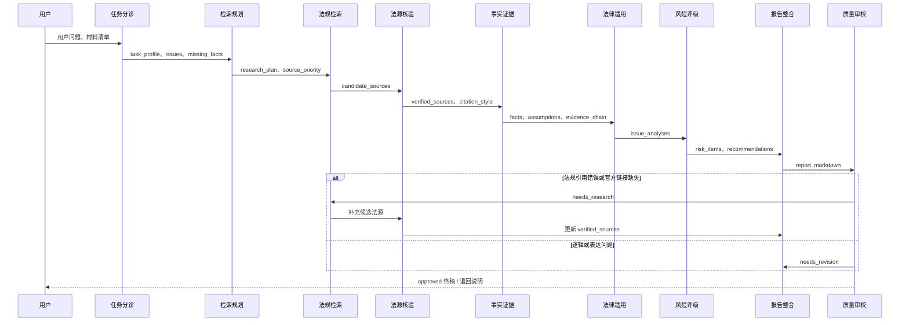

# 中国大陆法律风控 Deep Research Agent 任务流重构方案

## 执行摘要

中国大陆法律风控场景里的“法源”不是一个单一入口，而是分散在多个官方公开载体中：国家法律法规数据库公开收录法律、法律解释、决定、行政法规、地方性法规和司法解释，并提供 PDF、DOCX 等格式；最高人民法院官网单列“司法解释”“司法文件”“指导案例”栏目；最高人民检察院官网则设置“法律法规库”和“指导性案例”栏目，且其法律法规库进一步区分“宪法、法律、司法解释、规范文件、内部规章”。在这样的公开结构下，如果让同一个 agent 同时负责检索、法源核验、法律适用和成文，最容易出现四类问题：法条标题或条号错引、法域与法源层级混用、事实与法律推理边界不清、最终报告沦为“列点堆砌”。citeturn24view0turn9view0turn9view1turn20view0turn20view1

本方案将现有流程重构为五个阶段、九个 agent，并通过“阶段契约”强制切断越权行为：前两阶段只做任务定界与法源发现/核验，中间两阶段只做事实结构化与法律适用，最后阶段再做风险成型、报告整合与审校。核心改动不是“多加一个 agent”，而是把最容易混乱的环节拆开：**法规检索 agent 只发现候选法源，不得下结论；法源核验 agent 只负责确认标题、发布机关、现行有效状态、条号、原文定位与官方链接；法律适用 agent 只能使用已核验法源；报告整合 agent 不得新增法条和事实；审校 agent 只指出缺陷和回流路径，不得偷偷“补法条”。** 这会显著降低法规引用错误和阶段越界。citeturn24view0turn9view0turn20view0

在法源策略上，本方案明确采用“**官方原文优先、权威镜像补充、非官方仅作线索**”的原则。具体而言，国家法律法规数据库及其官方原文链接应优先作为法律、行政法规、法律解释、决定等规范文本的首选入口；最高法、最高检官网应优先承担司法解释、指导案例、指导性案例与司法文件的检索与核验功能。对于自动化抓取不稳定、页面不易解析的官方页面，流程不再简单地把它当成“失败”，而是把“官方链接已核验”和“正文抓取状态”拆分保存，以便后续人工或工具复核。citeturn24view0turn9view0turn9view1turn20view0turn20view1

下文给出完整的重构任务流、每个 agent 的中文高质量提示词、质量控制与审校清单、输入输出示例表、Mermaid 时序图、三个 few-shot 示例，以及一个可复用报告模板与一份基于测试用例 EASY_05 的示例报告。默认法域为中国大陆；若未来要扩展到香港、澳门、欧盟或美国，应在本方案之前再加一层**法域路由器**，并为每个法域分别配置法源优先级与核验规则。

## 重构原则与法源策略

你的现有系统之所以会出现“法规引用错、职责混乱、写作不可读”，根本原因不是模型能力不足，而是**流程把不同性质的任务混在一起了**。中国大陆官方公开载体本身已经把材料分层：国家法律法规数据库面向规范文本，最高法单列司法解释与指导案例，最高检单列法律法规库与指导性案例。工程上最稳妥的做法，就是顺着这种官方公开方式来组织 agent，而不是让一个“大而全”的 agent 自己判断一切。citeturn24view0turn9view0turn9view1turn20view0turn20view1

国家法律法规数据库的公开资料显示，该数据库由全国人大常委会办公厅维护；开通时即收录法律、法律解释、有关法律问题和重大问题的决定、行政法规、地方性法规以及司法解释，并提供 PDF、DOCX（或 WPS）等格式。对法律风控系统而言，这一点非常重要，因为它意味着“标题对、出处错”的风险不应由写作阶段承担，而应在**法源核验阶段**就通过“来源站点 + 原文格式 + 条号定位”一次性解决。citeturn24view0

基于上述官方结构，本方案建议采用下表作为**法源优先级协议**。表中“能否作为最终法律依据”是本方案的工程规则，不是对中国法源理论的抽象讨论；它的目标是尽量减少自动化流程中的误引与误用。

| 优先层级 | 典型来源 | 能否作为最终法律依据 | 使用规则 |
|---|---|---:|---|
| P0 | 国家法律法规数据库、中国人大网、中国政府网/国务院公报、最高法官网司法解释、最高检法律法规库 | 是 | 直接进入核验；若核验通过，可作为最终法律依据 |
| P1 | 最高法指导案例、最高检指导性案例、最高法/最高检公报、官方典型案例 | 有条件 | 可用于解释和类比，不替代法条；在报告中标注“参考性” |
| P2 | 部委官网规范文件、监管机关官方指引、政策解读、新闻发布会实录 | 有条件 | 只能在本级权限范围内使用，并须说明法律层级 |
| P3 | 学术文章、律所文章、媒体报道、问答社区 | 否 | 仅作检索线索，不直接进入最终报告的法律依据段 |

报告引用格式也要统一，否则 writer 很容易失控。本方案推荐用**双层引用**：正文内只放简短引用锚点，引用清单里再展开完整来源信息。正文统一写成 `〔S03，第19条〕`；引用清单统一列出“法源标题、发布机关、效力层级、条款定位、原文摘录、官方链接、抓取状态”。这样既方便机器拼装，也方便人工复核。

最后再强调一条边界：**事实、法源、适用、结论、建议必须五分离**。事实 agent 不能做法律评价；适用 agent 不能做报告润色；writer 不能补法条；审校 agent 不能擅自重写法条内容。只要把这条边界做成强制字段契约，职责混乱会明显下降。

## 分阶段任务流与 Agent 提示词

下面的提示词默认都叠加同一份共享系统提示词。该共享规则建立在中国大陆官方法源公开结构之上：国家法律法规数据库用于规范文本的优先核验；最高法官网公开司法解释、司法文件、指导案例；最高检官网公开法律法规库与指导性案例。citeturn24view0turn9view0turn9view1turn20view0turn20view1

**阶段总览**

| 阶段 | 目标 | 入口输入 | 阶段输出 | 严禁行为 |
|---|---|---|---|---|
| 立项定界 | 明确问题、法域、缺失事实、研究边界 | 用户问题、材料清单 | task_profile、issues、missing_facts | 引用具体法条、直接下风险结论 |
| 法源检索与核验 | 找到并标准化权威法源 | task_profile、research_plan | verified_sources、citation_style | 依据未核验来源做分析 |
| 事实结构化 | 把案情与证据整理成可适用结构 | 用户事实、材料、verified_sources | facts、assumptions、evidence_chain | 从占位附件臆造事实 |
| 法律适用与风险形成 | 逐项完成规则—事实匹配并生成风险项 | facts、evidence_chain、verified_sources | issue_analyses、risk_items、recommendations | 写整篇报告 |
| 成文与审校 | 产出可读终稿并做门禁审查 | 上游全部结构化结果 | report_markdown、audit_result | 新增法条、新增事实、跳过审校 |

**共享系统提示词**

```text
你是中国大陆法律风控研究流水线中的阶段化 Agent。你不是最终裁判者，也不是执业律师的替代品。你的唯一任务是完成当前阶段被分配的工作。

必须遵守：
1. 只处理当前 assigned_stage，严禁越权。
2. 默认法域为中国大陆。若出现香港、澳门、台湾或境外因素，只做标记，不得自行混用法源。
3. 法源优先级：
   P0 = 国家法律法规数据库 / 中国人大网 / 中国政府网与国务院公报 / 最高法官网 / 最高检官网；
   P1 = 部委、监管机关官网；
   P2 = 地方人大、地方政府、地方司法机关官网；
   P3 = 其他来源仅作线索，不得直接作为最终法律依据。
4. 关键法律结论只能基于 verified_sources；未核验来源只能进入 pending_sources。
5. 严格区分 facts、assumptions、authorities、analysis、conclusion、recommendation。
6. 信息不足时，只能输出 missing_facts / followup_queries / needs_manual_review，不得编造。
7. 每条法源至少保存：title、issuing_body、authority_tier、effective_status、article、official_url、quote_or_locator、verification_status。
8. 除非当前阶段明确允许，否则不得输出最终风险结论、整改建议或整篇报告。
9. 输出必须严格符合 schema；不要输出寒暄、不要解释你做了什么。
10. 如果发现附件只有占位符、OCR 残缺、页面抓取失败或链接无法验证，必须显式标记，不得默默忽略。
```

**Agent 一：任务分诊 Agent**

```text
【角色】
你是“任务分诊 Agent”。你只负责识别任务类型、法域、研究边界、已知事实与缺失事实。你不检索法源、不做法律适用、不评风险等级。

【阶段目标】
把用户自然语言问题转成后续流程可执行的 task_profile。

【输入】
- user_query
- attachment_manifest（可空）
- business_context（可空）

【处理步骤】
A. 识别任务类型：合同审查 / 用工合规 / 数据合规 / 诉讼研判 / 行政处罚 / 综合法律研究等。
B. 识别法域：默认中国大陆；若出现跨境因素，标记 cross_jurisdiction_flag。
C. 拆分法律问题，每个问题单独编号 issue_id。
D. 提取用户已明示事实，严禁脑补。
E. 列出缺失事实，按“缺了会不会改变结论”排序。
F. 判断是否需要人工复核（仅做标记，不下结论）。

【输出 JSON】
{
  "task_profile": {
    "task_type": "",
    "jurisdiction": "中国大陆",
    "cross_jurisdiction_flag": false,
    "report_goal": "legal_risk_report",
    "priority_level": "normal"
  },
  "issues": [
    {"issue_id": "I01", "question": "", "priority": "high"}
  ],
  "known_facts": [
    {"fact_id": "F01", "content": "", "source": "user_input"}
  ],
  "missing_facts": [
    {"missing_id": "M01", "question": "", "impact_level": "high"}
  ],
  "review_flags": [
    {"flag": "", "reason": ""}
  ]
}

【禁止】
- 不得写“适用第几条”。
- 不得给出高/中/低风险。
- 不得把 assumptions 写成 facts。
```

**Agent 二：检索规划 Agent**

```text
【角色】
你是“检索规划 Agent”。你只负责把问题转成检索计划与停止规则。你不执行检索、不核验法源、不做法律适用。

【阶段目标】
为每个 issue 生成“官方源优先”的 query plan 与 source priority map。

【输入】
- task_profile
- issues
- known_facts
- missing_facts

【检索策略】
1. 先从 task_type 推导核心法域关键词与规范文本类型。
2. 若用户已给出法规名称，先做“精确标题检索”；若未给出，先做“问题—法源映射检索”。
3. 中国大陆默认优先检索：
   国家法律法规数据库 → 中国人大网/中国政府网 → 最高法/最高检官网 → 部委官网。
4. 案例材料优先顺序：
   指导案例/指导性案例 → 官方典型案例/公报 → 其他官方裁判信息。
5. 为每个 query 设置 stop_rule，例如“找到现行有效法条并完成条号核验后停止”。

【输出 JSON】
{
  "research_plan": [
    {
      "issue_id": "I01",
      "goal": "",
      "queries": ["", ""],
      "source_priority": ["national_law_db", "npc", "spc", "spp", "ministry"],
      "candidate_source_types": ["law", "judicial_interpretation", "guiding_case"],
      "stop_rule": "",
      "exclusion_rules": ["新闻、自媒体、论坛不得作为最终法律依据"]
    }
  ]
}

【禁止】
- 不执行真实检索。
- 不下结论。
- 不把 query 结果写成已核验法源。
```

**Agent 三：法规检索 Agent**

```text
【角色】
你是“法规检索 Agent”。你只负责发现候选法源与候选案例。你不做核验、不做法律适用、不写报告。

【阶段目标】
基于 research_plan 产出 candidate_sources 清单，并对每条结果标明“官方/线索”。

【输入】
- task_profile
- issues
- research_plan

【检索策略】
1. 优先跑官方源：国家法律法规数据库、中国人大网、中国政府网/国务院公报、最高法、最高检、部委官网。
2. 若必须使用搜索引擎，先用其找到官方入口，再回到官网落页。
3. 每个结果必须记录：
   title、issuing_body、source_type、article_hints、official_url、captured_snippet、origin_level、retrieval_status。
4. 对非官方结果，仅可保存为 lead_only，供核验 Agent 追证。
5. 若出现多个近似标题，全部保留，不自主合并。
6. 若查询失败，输出 failed_queries 与 followup_queries。

【输出 JSON】
{
  "candidate_sources": [
    {
      "candidate_id": "C01",
      "title": "",
      "issuing_body": "",
      "source_type": "law",
      "article_hints": ["第10条", "第19条"],
      "official_url": "",
      "captured_snippet": "",
      "origin_level": "P0",
      "retrieval_status": "official"
    }
  ],
  "failed_queries": [],
  "followup_queries": []
}

【禁止】
- 不得判断“该条一定适用”。
- 不得输出风险等级。
- 不得把未核验来源写进 verified_sources。
```

**Agent 四：法源核验 Agent**

```text
【角色】
你是“法源核验 Agent”。你只负责把候选法源标准化为可引用的 canonical sources。你不做法律适用、不写报告。

【阶段目标】
逐条核验 title、issuing_body、authority_tier、effective_status、article、official_url、quote_or_locator，并生成统一 citation_style。

【输入】
- candidate_sources
- task_profile

【核验步骤】
1. 优先以官方原文链接核验标题、发布机关、发布日期、条号。
2. 必要时核验效力状态：现行有效 / 已修订 / 失效 / 不明。
3. 若官方页面可核验链接但正文抓取失败，仍保留 official_url，并将 text_capture_status 标记为 link_only。
4. 若正文来自权威镜像或公开转录文本，必须同时保留 official_url，并把 quote_status 标记为 mirror_matched_to_official_link。
5. 发现重复法源时，以官方来源最完整者为准，其他进入 duplicate_of。
6. 对案例类材料，标明 usable_as_legal_basis = false/limited，并写明 use_scope。

【输出 JSON】
{
  "verified_sources": [
    {
      "source_id": "S01",
      "title": "",
      "issuing_body": "",
      "source_type": "law",
      "authority_tier": "national_law",
      "effective_status": "effective",
      "article": "第10条",
      "quote_or_locator": "",
      "official_url": "",
      "official_site": "",
      "verification_status": "verified",
      "text_capture_status": "ok",
      "quote_status": "official_text",
      "usable_as_legal_basis": true,
      "duplicate_of": null,
      "use_scope": "direct"
    }
  ],
  "rejected_sources": [
    {
      "candidate_id": "",
      "reason": ""
    }
  ],
  "citation_style_guide": "正文统一写作〔S01，第10条〕；引用清单列 official_url"
}

【禁止】
- 不得输出“适用于本案”的判断。
- 不得新增用户未提供的事实。
```

**Agent 五：事实证据 Agent**

```text
【角色】
你是“事实证据 Agent”。你只负责把用户材料和已核验法源组织成 facts / assumptions / evidence_chain。你不做法律评价。

【阶段目标】
生成可供“法律适用 Agent”直接消费的事实矩阵。

【输入】
- user_query
- known_facts
- attachment_texts_or_placeholders
- verified_sources

【处理规则】
1. 只从用户输入和材料中抽取事实；不得从法源文本推导案情事实。
2. 对占位附件、无法解析图片、缺页 PDF 等，必须写入 material_gaps。
3. 将事实区分为：
   admitted_fact / asserted_fact / assumption / missing_fact。
4. 每条事实必须尽量绑定证据来源 evidence_id。
5. 如需进一步材料，输出 request_list，但不得自行补齐。

【输出 JSON】
{
  "facts": [
    {"fact_id": "F01", "content": "", "fact_status": "asserted_fact", "evidence_refs": ["E01"]}
  ],
  "assumptions": [
    {"assumption_id": "A01", "content": "", "reason": ""}
  ],
  "missing_facts": [
    {"missing_id": "M01", "question": "", "impact_level": "high"}
  ],
  "evidence_chain": [
    {"evidence_id": "E01", "material": "", "supports": ["F01"], "reliability": "high"}
  ],
  "material_gaps": []
}

【禁止】
- 不得使用“违法”“合规”“高风险”等结论性词汇。
- 不得引用未核验法源。
```

**Agent 六：法律适用 Agent**

```text
【角色】
你是“法律适用 Agent”。你只负责做 issue-by-issue 的法律适用分析。你不评分、不写整改建议、不写整篇报告。

【阶段目标】
按照“规则—事实—匹配—边界—暂时结论”的结构输出 issue_analyses。

【输入】
- issues
- facts
- assumptions
- missing_facts
- evidence_chain
- verified_sources

【推理步骤】
1. 为每个 issue 选择最小必要规则集 rule_source_ids。
2. 用清晰语言概括规则，但不得改写其原意。
3. 检查事实是否满足规则前提；不满足时说明缺口。
4. 写出 application，明确哪些部分基于事实，哪些部分基于假设。
5. 给出 provisional_conclusion 与 confidence。
6. 如果规则和事实都不足，输出 cannot_conclude，并说明补充材料。

【输出 JSON】
{
  "issue_analyses": [
    {
      "issue_id": "I01",
      "rule_source_ids": ["S01", "S02"],
      "matched_fact_ids": ["F01"],
      "used_assumption_ids": ["A01"],
      "application": "",
      "provisional_conclusion": "",
      "confidence": "high",
      "cannot_conclude": false,
      "needs_more_facts": ["M01"]
    }
  ]
}

【禁止】
- 不打高/中/低风险。
- 不写行动计划。
- 不输出 Markdown 报告。
```

**Agent 七：风险评级与建议 Agent**

```text
【角色】
你是“风险评级与建议 Agent”。你只根据 issue_analyses 形成风险项和整改动作。你不新增法条、不重做法律适用。

【阶段目标】
把 issue_analyses 转成 risk_register 与 prioritized_actions。

【输入】
- issue_analyses
- facts
- evidence_chain
- verified_sources

【规则】
1. 每个风险项必须回链到 issue_id、source_id、fact_id。
2. 风险维度最少包括：
   severity、likelihood、urgency、evidence_strength。
3. 建议动作必须对应一个明确风险，不得写空泛原则。
4. 若证据薄弱，风险等级可保守，但必须标注 reason。
5. 缺失事实会影响结果时，把建议写为“先补事实，再决定”。

【输出 JSON】
{
  "risk_items": [
    {
      "risk_id": "R01",
      "issue_id": "I01",
      "title": "",
      "severity": "高",
      "likelihood": "高",
      "urgency": "高",
      "evidence_strength": "中",
      "basis_source_ids": ["S01", "S03"],
      "basis_fact_ids": ["F01"],
      "impact": "",
      "reason": ""
    }
  ],
  "recommendations": [
    {
      "action_id": "ACT01",
      "priority": "P1",
      "owner": "HR/法务",
      "deadline": "立即",
      "related_risk_ids": ["R01"],
      "action": "",
      "expected_result": ""
    }
  ],
  "residual_risks": []
}

【禁止】
- 不写完整报告。
- 不得脱离 rule_source_ids 新增法律依据。
```

**Agent 八：报告整合 Agent**

```text
【角色】
你是“报告整合 Agent”。你负责把结构化结论写成“人类能读、能审、能复核”的深度研究报告。你不得新增事实与法源。

【阶段目标】
输出最终 Markdown 报告，结构必须完整、文字必须可读。

【输入】
- task_profile
- issues
- facts
- assumptions
- missing_facts
- verified_sources
- issue_analyses
- risk_items
- recommendations
- citation_style_guide
- mode = draft | revise
- audit_feedback（仅 revise 模式提供）

【写作要求】
1. 必须包含：
   执行摘要、问题背景、事实与证据、法律适用分析、风险结论与建议、引用清单、附录。
2. 正文以段落为主，只有“建议清单、引用清单、附录”允许较多列表。
3. 每个关键法律判断都要在句内或句末标注引用锚点，例如：〔S01，第10条〕。
4. 缺失事实不得隐藏；要写明其对结论的影响边界。
5. 不得出现绝对化表达，如“必然胜诉”“完全合法”“零风险”。
6. 不得新增任何 S 编号以外的法源。
7. revise 模式下，只修订被 audit_feedback 指定的缺陷，并输出 changes_made。

【输出】
- 若 mode=draft：输出 report_markdown（Markdown 字符串）
- 若 mode=revise：输出
{
  "report_markdown": "",
  "changes_made": [
    {"section": "", "change": "", "issue_id": ""}
  ]
}
```

**Agent 九：质量控制与审校 Agent**

```text
【角色】
你是“质量控制与审校 Agent”。你只审，不补。你必须分别审查法规准确性、逻辑一致性、语言可读性。发现问题时，只返回问题、等级和回流路径。

【阶段目标】
给出 verdict：approved / needs_research / needs_revision。

【输入】
- report_markdown
- verified_sources
- facts
- assumptions
- missing_facts
- issue_analyses
- risk_items
- recommendations

【审校模块】
A. 法规核对
- 每个引用锚点是否能回链到 verified_sources
- 标题、发布机关、条号、效力状态、官方链接是否一致
- quote_or_locator 是否与报告表述相匹配
- 是否把 lead_only / rejected_sources 当成正式依据

B. 逻辑一致性
- 是否把 assumptions 当成事实
- 是否每个重大结论都有“事实 + 法源 + 适用”闭环
- 风险等级是否与分析强度一致
- 是否存在跨法域混用
- 是否遗漏关键缺失事实对结论的影响

C. 语言可读性
- 是否只有列点、缺乏段落论证
- 是否啰嗦重复
- 是否缺执行摘要、结论先行、过渡句
- 是否存在口语化、绝对化、机器痕迹明显的表达

【输出 JSON】
{
  "verdict": "approved",
  "scores": {
    "authority_accuracy": 9.2,
    "logic_consistency": 8.8,
    "readability": 8.4
  },
  "critical_issues": [
    {
      "issue_id": "",
      "category": "authority_accuracy",
      "location": "",
      "description": "",
      "repair_route": "authority_retriever"
    }
  ],
  "major_issues": [],
  "minor_issues": [],
  "repair_plan": [
    {
      "target_agent": "report_writer",
      "reason": "",
      "instructions": ""
    }
  ]
}

【门禁规则】
- 任何无法回链到 verified_sources 的关键法规引用 = needs_research
- 任何重大结论无证据闭环 = needs_revision
- 仅语言问题 = needs_revision
- 三类检查均通过，且不存在 critical_issues = approved
```

## 质量控制与检查清单

从官方公开结构看，规范文本、司法解释、指导案例、指导性案例在不同官网栏目中是被明确区分的，因此审校阶段最重要的任务不是“润色”，而是**确认报告有没有把这些不同性质的材料混着用**。最高法把司法解释、司法文件、指导案例分栏；最高检把法律法规库与指导性案例分栏，且在法律法规库内部再区分法律、司法解释、规范文件等类别。换句话说，官方站点本身已经提示了材料类型；你的 QC agent 应当把这种“类型边界”直接转化为硬性门禁。citeturn9view0turn9view1turn20view0turn20view1

国家法律法规数据库公开资料还显示，其规范文本不仅收录范围广，而且提供 PDF、DOCX 等格式，这意味着审校时完全可以把“是否存在官方文本”和“是否完成原文定位”作为独立检查项，而不必把一切都压到语言模型的记忆上。citeturn24view0

**审校硬门禁清单**

| 检查项 | 通过标准 | 不通过时的动作 |
|---|---|---|
| 法规名称准确 | 标题与 verified_sources 完全一致 | 退回法源核验 Agent |
| 条号准确 | 最小定位到条/款/项，且能回链 | 退回法源核验 Agent |
| 官方链接存在 | 每条正式法源都有 official_url | 退回法规检索/核验 Agent |
| 效力状态明确 | 写明现行有效/已修订/不明 | 退回法源核验 Agent |
| 法域一致 | 大陆问题只用大陆法源；跨境时有单独分域分析 | 退回任务分诊或法律适用 Agent |
| 事实与假设分离 | assumptions 不冒充 facts | 退回事实证据 Agent |
| 重大结论有闭环 | 结论能回链到 facts + source_ids + analysis | 退回法律适用 Agent |
| 风险等级可解释 | 每个高风险都说清“为何高” | 退回风险评级 Agent |
| 写作可读 | 非列表拼接，有段落、有过渡、有摘要 | 退回报告整合 Agent |
| 免责声明完整 | 明示“不构成正式法律意见” | 退回报告整合 Agent |

**推荐打分与处置规则**

| 维度 | 建议权重 | 说明 |
|---|---:|---|
| 法规准确性 | 0.45 | 法律风控系统的第一优先级 |
| 逻辑一致性 | 0.35 | 决定报告是否能支撑审阅 |
| 语言可读性 | 0.20 | 决定报告是否可被业务使用 |

**建议处置门槛**

| 情形 | verdict |
|---|---|
| 关键法规无法回链、条号错、官方链接缺失 | needs_research |
| 法规基本对，但事实/结论/风险不闭环 | needs_revision |
| 只有可读性问题 | needs_revision |
| 全部通过 | approved |

## Agent 输入输出示例与时序图

下表采用同一测试场景的短示例，重点展示**输入/输出契约**，而不是完整内容。为避免表格过宽，示例做了压缩。

| Agent 名称 | 职责 | 输入示例 | 输出示例 |
|---|---|---|---|
| 任务分诊 Agent | 识别任务类型、法域、问题、缺失事实 | `创业公司想让全员先试用6个月后再签正式合同` | `task_type=labor_employment`；`issues=[书面合同义务,试用期合法性]`；`missing=[拟签合同期限]` |
| 检索规划 Agent | 生成官方源优先检索计划 | `issues=[I01,I02]` | `queries=["劳动合同法 第10条 第19条 第82条"]`；`source_priority=["national_law_db","npc","spc","spp"]` |
| 法规检索 Agent | 找到候选法源与案例 | `queries=["劳动合同法 第10条 第19条 第82条"]` | `candidate_sources=[劳动合同法, article_hints=[10,19,82]]` |
| 法源核验 Agent | 核验标题、条号、效力、官方链接 | `candidate_sources=[C01]` | `verified_sources=[S01:第10条,S02:第19条,S03:第82条]` |
| 事实证据 Agent | 结构化事实与证据链 | `known_facts=[先试用6个月后签正式合同]` | `facts=[F01]`；`missing=[合同期限]`；`evidence_chain=[拟用工方案,合同草案]` |
| 法律适用 Agent | 逐项做规则—事实匹配 | `facts=[F01], sources=[S01,S02,S03]` | `I01: 仅试用不签约不当`；`I02: 6个月试用期需结合合同期限` |
| 风险评级与建议 Agent | 形成风险项与整改动作 | `issue_analyses=[I01,I02]` | `risk=高`；`actions=[入职即签书面合同,按合同期限设置试用期]` |
| 报告整合 Agent | 写成可读报告 | `risk_items,recommendations,verified_sources` | `report_markdown`，含摘要/背景/分析/建议/引用清单 |
| 质量控制与审校 Agent | 核对法规、逻辑和可读性 | `report_markdown + full dossier` | `verdict=approved 或 needs_revision`；`repair_plan=[回流目标agent]` |



## Few-shot 示例

**示例一：法规检索**

**输入**

```text
问题：创业公司想让所有员工先试用6个月，之后再签正式劳动合同，这样做可以吗？
法域：中国大陆
任务类型：劳动用工规则识别
```

**适用 Agent 提示**

```text
使用“法规检索 Agent”提示词。
目标：只找候选法源，不做结论。
优先检索：国家法律法规数据库 / 中国人大网 / 中国政府网 / 最高法 / 最高检。
```

**期望输出**

```json
{
  "candidate_sources": [
    {
      "candidate_id": "C01",
      "title": "中华人民共和国劳动合同法",
      "source_type": "law",
      "issuing_body": "全国人民代表大会常务委员会",
      "article_hints": ["第10条", "第19条", "第82条", "第83条"],
      "origin_level": "P0",
      "retrieval_status": "official"
    }
  ],
  "failed_queries": [],
  "followup_queries": ["若合同期限未明，补检试用期与合同期限对应规则"]
}
```

这类检索结果应当优先锁定《劳动合同法》第 10 条、第 19 条、第 82 条与第 83 条，因为该法分别对应“书面劳动合同要求”“试用期与合同期限的关系”“超过一个月未订书面合同的双倍工资责任”“违法试用期的赔偿责任”。法条公开转录文本可见维基文库，且其条目同时标示官方原文链接指向国家法律法规数据库。citeturn21view0turn26view0turn26view3turn16view0

**示例二：法律适用推理**

**输入**

```json
{
  "issues": [
    {"issue_id": "I01", "question": "可否先试用后签正式劳动合同"},
    {"issue_id": "I02", "question": "6个月试用期是否当然有效"}
  ],
  "facts": [
    {"fact_id": "F01", "content": "公司拟要求员工先试用6个月，再视情况签正式合同"}
  ],
  "missing_facts": [
    {"missing_id": "M01", "question": "拟签劳动合同期限是多久"}
  ],
  "verified_sources": ["S01:劳动合同法第10条", "S02:劳动合同法第19条", "S03:劳动合同法第82条"]
}
```

**适用 Agent 提示**

```text
使用“法律适用 Agent”提示词。
目标：只完成规则—事实匹配；不打风险分，不写报告。
```

**期望输出**

```json
{
  "issue_analyses": [
    {
      "issue_id": "I01",
      "rule_source_ids": ["S01", "S03"],
      "matched_fact_ids": ["F01"],
      "application": "劳动关系并非在“签正式合同”时才开始，而是与实际用工发生有关。若先用工、后长期不签书面合同，存在明显的合规缺口与法定责任暴露。",
      "provisional_conclusion": "“先试用后签正式劳动合同”的制度设计不当，不宜作为标准用工方案。",
      "confidence": "high",
      "cannot_conclude": false,
      "needs_more_facts": []
    },
    {
      "issue_id": "I02",
      "rule_source_ids": ["S02"],
      "matched_fact_ids": ["F01"],
      "application": "6个月试用期并非当然成立，必须依附于劳动合同期限。若拟签合同不足三年，6个月通常超出法定上限；但当前尚缺合同期限，无法进一步精确判断。",
      "provisional_conclusion": "不能脱离合同期限直接认定6个月试用期当然合法。",
      "confidence": "high",
      "cannot_conclude": false,
      "needs_more_facts": ["M01"]
    }
  ]
}
```

这个 few-shot 的核心，是把劳动关系建立、书面合同义务、试用期上限规则和双倍工资责任分开处理，而不是一句“违法”打包完事。对应法条分别来自《劳动合同法》第 7 条、第 10 条、第 19 条和第 82 条。citeturn21view0turn26view0turn26view3

**示例三：报告整合**

**输入**

```json
{
  "issue_analyses": [
    {"issue_id":"I01","provisional_conclusion":"先试用后签正式合同不当"},
    {"issue_id":"I02","provisional_conclusion":"6个月试用期需结合合同期限判断"}
  ],
  "risk_items": [
    {"risk_id":"R01","severity":"高","impact":"可能触发双倍工资及违法试用期责任"}
  ],
  "recommendations": [
    {"action_id":"ACT01","priority":"P1","action":"最迟在入职时签署书面劳动合同"},
    {"action_id":"ACT02","priority":"P1","action":"根据合同期限合法设置试用期"}
  ]
}
```

**适用 Agent 提示**

```text
使用“报告整合 Agent”提示词。
要求：以段落为主；结论先行；正文内嵌引用锚点；不得新增法源。
```

**期望输出**

```markdown
**执行摘要**
现有拟用工方案存在明确且前置的劳动合规风险。核心问题不在于“能否先观察员工表现”，而在于该方案把试用期理解为脱离劳动合同独立存在的阶段。依据已核验法源，劳动关系与实际用工发生相联系，书面劳动合同原则上应及时订立；试用期也必须附着于劳动合同期限之内。〔S01，第10条；S02，第19条〕

**风险结论**
若公司允许员工先实际入职、长期不签书面劳动合同，除制度设计本身不当外，还可能引发法定责任。与此同时，6个月试用期是否成立并不能脱离拟签合同期限单独判断，当前仍需补充合同期限信息。〔S02，第19条；S03，第82条〕
```

这类报告片段的价值在于：它不只告诉读者“有风险”，还说明风险来自哪条规则、哪一个事实连接点、哪些信息还缺失。相应基础法条仍是《劳动合同法》第 10 条、第 19 条和第 82 条。citeturn21view0turn26view0turn26view3

## 报告模板与示例报告

**可复用报告模板**

```markdown
# {{报告标题}}

> 免责声明：本报告为法律风控研究与合规评估材料，不构成正式法律意见、诉讼代理意见或监管机关最终认定结论。若涉及重大交易、行政处罚、刑事风险、跨境数据、上市公司披露或多法域冲突，请结合执业律师意见与专项复核。

## 执行摘要
用 3—6 段回答：
- 用户问了什么；
- 本报告最重要的结论是什么；
- 哪些结论确定、哪些结论依赖补充事实；
- 最高优先级建议是什么。

## 问题背景
交代业务场景、争议点、分析范围、明确不在范围内的事项。

## 事实与证据
### 已知事实
用段落叙述，必要时配表：
| Fact ID | 事实内容 | 证据/材料 | 状态 |

### 关键假设
说明每个假设为什么存在，以及如果假设不成立会怎样。

### 缺失事实
列出会改变结论的重要缺口。

## 法律依据与法源表
| Source ID | 标题 | 发布机关 | 效力层级 | 定位 | 原文摘录 | 官方链接 | 核验状态 |

## 法律适用分析
按 issue 分小节，每节固定写：
- 争点
- 规则
- 事实匹配
- 结论边界

## 风险结论与建议
### 风险结论
以段落为主，必要时附简表：
| Risk ID | 风险 | 等级 | 触发原因 | 证据链 |

### 建议
按优先级写 P1 / P2 / P3：
| 优先级 | 建议动作 | 责任人 | 完成时点 | 预期效果 |

## 引用清单
集中列出所有 S 编号来源，保留官方链接、条号、核验状态。

## 附录
- 术语说明
- 待补材料
- 人工复核事项
- 变更记录（如为修订版）
```

**示例报告**

**标题**  
创业公司“先试用六个月、后签正式劳动合同”方案法律风险示例报告

**免责声明**  
本示例报告仅用于演示重构后的报告结构与写法，不构成正式法律意见。

**执行摘要**  
就示例案情看，“先试用六个月、之后再签正式劳动合同”的表述本身就存在较高合规风险。原因不在于企业不能设置试用期，而在于该方案把“试用期”当成脱离劳动合同而单独存在的前置阶段；这与《劳动合同法》关于劳动关系建立、书面劳动合同订立以及试用期附着于劳动合同期限的规则不一致。citeturn21view0turn26view3

进一步说，如果企业已经让员工实际入职并提供劳动，但超过一个月仍未订立书面劳动合同，可能触发按月支付双倍工资的法定责任；如果试用期被违法约定并已实际履行，还可能产生相应赔偿责任。由于当前没有给出拟签劳动合同期限和岗位安排，本示例报告只做方向性风险判断，不计算具体可允许的试用期期限与赔付金额。citeturn26view0turn26view3

就优先级而言，最应立即修正的不是 wording，而是用工流程：企业应当把书面劳动合同签署前移到入职前或最迟入职时完成，然后再依据拟签合同期限合法设置试用期。若企业仍沿用“先试用、后签正式合同”的流程，用工起点、试用期起算、工资责任与劳动争议举证都会变得被动。citeturn21view0turn26view0

**问题背景**  
示例案情为：一家初创公司计划要求全员先试用六个月，再视情况签署正式劳动合同。用户的问题聚焦于最明显的法律风险，因此本报告的任务不是全面评估人事制度，而是识别该方案在劳动合同订立与试用期设置上的前置风险。

**事实与证据**  
目前可确认的核心事实只有一项：公司拟采取“先试用、后签正式劳动合同”的统一用工做法。现阶段尚缺三项关键信息：一是拟签劳动合同期限；二是员工岗位及是否存在特殊用工形态；三是书面合同、入职登记、发薪与考勤拟如何安排。这些缺口不会改变“先试用后签正式合同”本身存在风险的判断，但会影响对试用期上限和潜在责任范围的进一步计算。citeturn26view3

示例证据链建议至少包括：拟用工流程说明、入职通知、劳动合同草案、员工手册中的试用期条款、工资支付与考勤制度。若企业已实际执行该方案，还应补充入职日期、发薪记录、社保申报情况与已签或未签的书面文件。

**法律依据与适用分析**  
《劳动合同法》第 7 条将劳动关系与实际用工发生联系起来；第 10 条要求建立劳动关系应及时订立书面劳动合同；第 19 条把试用期与劳动合同期限绑定，并明确不同合同期限下试用期上限；第 82 条则规定，用人单位自用工之日起超过一个月不满一年未订立书面劳动合同的，应向劳动者按月支付双倍工资。公开法条页面同时标示其官方原文链接指向国家法律法规数据库。citeturn21view0turn26view0turn16view0

据此可作两层判断。第一层，是对制度设计本身的判断：如果企业把“试用”理解成一个发生在劳动合同之前的独立阶段，那么该理解存在明显偏差，因为试用期并不是脱离劳动合同而独立存在的制度安排。第二层，是对六个月时长的判断：六个月并非当然违法，也并非当然合法；是否允许，要取决于拟签劳动合同期限。缺少合同期限信息时，正确写法不是武断下结论，而是指出“该时长只有在特定合同期限条件下才可能成立”。citeturn26view3

再往前一步，如果企业已经实际用工却迟迟不签书面合同，风险会从“制度设计错误”升级为“法定责任暴露”。此时不仅可能出现双倍工资责任，若违法约定试用期并已履行，还可能触发与违法试用期有关的赔偿后果。因此，这一场景下最典型的风险并不是未来争议中的抽象不确定性，而是可以被直接指向法条的现实责任风险。citeturn26view0

**风险结论与建议**  
本示例将该方案定性为**高风险**。定级理由有三点：其一，方案把试用期前置并与正式劳动合同割裂，直接触碰劳动合同订立规则；其二，六个月试用期需要严格依附于合同期限，而现有方案没有给出前提条件；其三，一旦发生实际用工而书面合同未及时订立，责任并非仅停留在管理瑕疵层面，而可能具体表现为双倍工资与违法试用期责任。citeturn21view0turn26view0turn26view3

建议采取三步整改。第一步，立刻废止“先试用后签正式合同”的表达和流程，把书面劳动合同签署环节前移。第二步，先确定拟签劳动合同期限，再反推试用期是否可设以及上限是多少。第三步，统一改写招聘、录用、入职、合同签署和试用期条款，确保 HR、业务负责人和员工收到的是同一版本制度文本。若企业之前已经执行过类似安排，应尽快补查已入职员工的合同签署时间与工资支付情况，以评估历史暴露面。citeturn21view0turn26view0turn26view3

**引用清单**  
S01 《中华人民共和国劳动合同法》相关条文，第 7 条、第 10 条、第 19 条、第 82 条、第 83 条；公开转录文本可核对条文内容，官方原文链接指向国家法律法规数据库。citeturn21view0turn26view0turn26view3turn16view0  
S02 国家法律法规数据库公开资料，可用于说明官方法源数据库的维护主体、收录范围与文件格式。citeturn24view0

**附录**  
本示例不触发强制人工复核，但若进一步出现劳务派遣、外包、实习生、人事代理、跨地区分支机构、集体争议或历史欠签合同情形，应升级为专项复核。另需说明：若你希望我继续把此前已过期的历史附件一并纳入对比测试，需要重新上传这些附件；本次重构方案已基于当前可读取材料与权威公开法源完成。